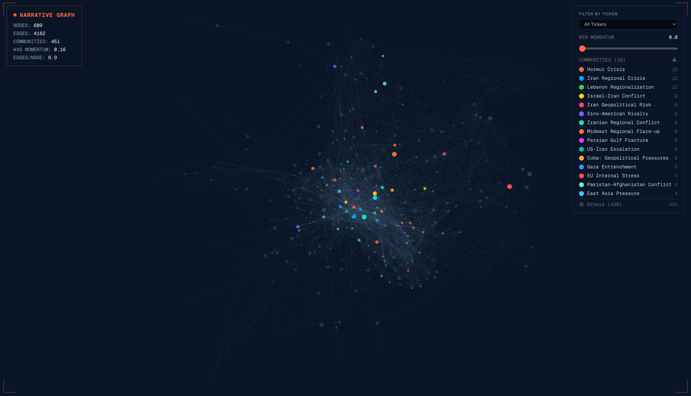
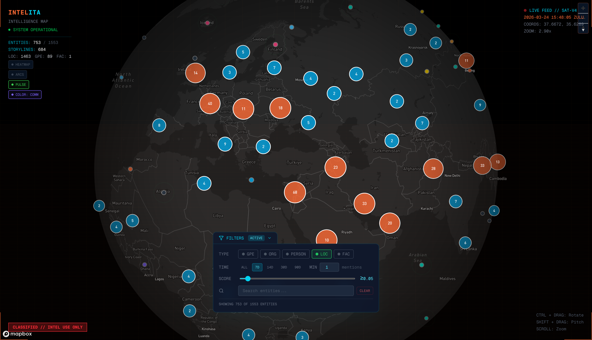
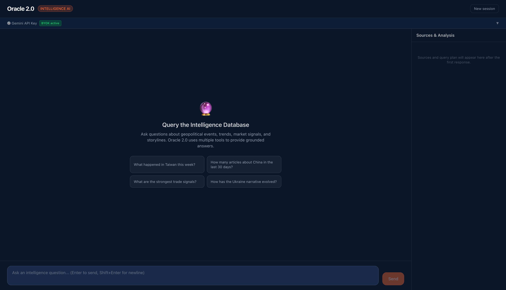

# INTELLIGENCE_ITA

End-to-end geopolitical intelligence platform: 33+ RSS feeds → NLP → PostgreSQL/pgvector → Narrative Engine → RAG + LLM reports → Oracle 2.0 AI chat → FastAPI + Next.js frontend.

---

## Screenshots

| Narrative Graph | Intelligence Map | Oracle 2.0 |
|:-:|:-:|:-:|
|  |  |  |

---

## Architecture

```
RSS Feeds (33+ sources)
    │
    ▼
Ingestion ── async aiohttp (parallel) ── Trafilatura → Scrapling → Newspaper3k
    │        2-phase deduplication      Filtro 1: keyword blocklist
    │        PDF auto-detection (2-level, pymupdf4llm)
    │
    ▼
NLP Processing ── spaCy xx_ent_wiki_sm (NER) ── 384-dim embeddings
    │              Filtro 2: LLM relevance classification (Gemini 2.0 Flash)
    │
    ▼
PostgreSQL + pgvector (HNSW index)
    │
    ▼
Narrative Engine ─────────────────────────────────────────────────────────────┐
    │  Stage 1: Micro-clustering (cosine sim > 0.90)                          │
    │  Stage 2: Adaptive matching (hybrid score: cosine + entity boost - decay)│
    │  Stage 3.5: Orphan buffer retry (14-day pool)                           │
    │  Stage 3: HDBSCAN discovery (orphan events → new storylines)            │
    │  Stage 4: LLM summary evolution (Gemini 2.0 Flash)                      │
    │  Stage 4b: Filtro 4 post-clustering validation (regex scope check)      │
    │  Stage 5: TF-IDF weighted Jaccard graph edges                           │
    │  Stage 6: Momentum decay (weekly ×0.7)                                 │
    └──────────────────────────────────────────────────────────────────────────┘
    │
    ▼
RAG + LLM Report Generation (Gemini 2.5 Flash)
    │  Multi-query expansion → HNSW vector search (top-20) → cross-encoder reranking → top-10
    │  Narrative context: top-10 storylines injected as XML
    │  Sections: Executive Summary, Key Developments, Trend Analysis,
    │            Investment Implications, Strategic Storyline Tracker
    │
    ├──▶ Trade Signals (Macro-first pipeline)
    │        → Intelligence Scoring (0-100): LLM confidence - SMA200 penalty + PE score
    │
    └──▶ HITL Review (Streamlit dashboard)
             │
             ▼
         FastAPI backend (X-API-Key auth, slowapi rate limiting)
             │
             ▼
         Next.js 16 frontend
             ├── /dashboard  (reports list + detail + comparison delta)
             ├── /map        (Mapbox GL geospatial entity map)
             ├── /stories    (react-force-graph-2d narrative network)
             └── /oracle     (Oracle 2.0 AI chat)

         Oracle 2.0 (AI Chat Engine)
             ├── QueryRouter: 6 intent types (FACTUAL/ANALYTICAL/NARRATIVE/MARKET/COMPARATIVE/OVERVIEW)
             ├── Tools: RAG, SQL, Aggregation, Graph, Market, TickerThemes, ReportCompare
             └── ConversationMemory + TTL caching + anti-hallucination guard
```

---

## Project Structure

```
INTELLIGENCE_ITA/
├── config/
│   ├── feeds.yaml                        # 33+ RSS feed definitions with categories
│   ├── top_50_tickers.yaml               # Geopolitical market movers whitelist
│   └── entity_blocklist.yaml             # Noise-filtering for extracted entities
├── src/
│   ├── ingestion/
│   │   ├── feed_parser.py                # Async RSS/Atom parser (aiohttp, parallel)
│   │   ├── content_extractor.py          # Full-text extraction (Trafilatura → Scrapling → Newspaper3k)
│   │   ├── pdf_ingestor.py               # PDF extraction via pymupdf4llm → Markdown
│   │   └── pipeline.py                   # Orchestrated ingestion (Filtro 1 blocklist)
│   ├── nlp/
│   │   ├── processing.py                 # Text cleaning, section-aware chunking, NER, embeddings
│   │   ├── narrative_processor.py        # Narrative Engine (~1498 lines)
│   │   ├── relevance_filter.py           # Filtro 2: LLM relevance classification
│   │   └── bullet_generator.py           # AI-extracted article bullet points
│   ├── storage/
│   │   └── database.py                   # DatabaseManager (~2445 lines), pgvector ops
│   ├── llm/
│   │   ├── report_generator.py           # RAG pipeline + narrative context (~2700 lines)
│   │   ├── oracle_orchestrator.py        # Oracle 2.0 coordinator (singleton, TTL cache)
│   │   ├── oracle_engine.py              # Oracle 1.0 (backward-compat, Streamlit HITL)
│   │   ├── query_router.py               # 6-intent classification + QueryPlan + SQL injection defense
│   │   ├── query_analyzer.py             # Structured filter extraction from NL queries
│   │   ├── conversation_memory.py        # In-memory context deque (maxlen=10)
│   │   ├── schemas.py                    # Pydantic schemas for LLM structured output
│   │   └── tools/
│   │       ├── rag_tool.py               # Hybrid search + time-weighted decay + multi-query expansion
│   │       ├── sql_tool.py               # LLM-generated SQL with 5-layer safety
│   │       ├── aggregation_tool.py       # Pre-parametrized stats queries
│   │       ├── graph_tool.py             # Recursive CTE graph traversal
│   │       ├── market_tool.py            # Trade signals + macro indicators
│   │       ├── ticker_themes_tool.py     # Ticker → storylines correlation
│   │       └── report_compare_tool.py    # LLM-synthesized report delta
│   ├── api/
│   │   ├── main.py                       # FastAPI app, CORS, GZip, rate limiter
│   │   ├── auth.py                       # X-API-Key auth (secrets.compare_digest)
│   │   ├── routers/
│   │   │   ├── dashboard.py              # Stats and KPIs
│   │   │   ├── reports.py                # Report list, detail, compare delta
│   │   │   ├── stories.py                # Storyline graph, communities, ego network
│   │   │   ├── oracle.py                 # Oracle 2.0 chat (3/min rate limit)
│   │   │   ├── map.py                    # GeoJSON entities, arcs, stats (TTL cache 5min)
│   │   │   ├── ingest.py                 # Ingestion API
│   │   │   └── insights.py               # Insights endpoint
│   │   └── schemas/
│   │       ├── common.py                 # APIResponse[T], PaginationMeta
│   │       ├── dashboard.py              # DashboardStats Pydantic models
│   │       ├── reports.py                # Report Pydantic models
│   │       ├── stories.py                # Storyline graph Pydantic models
│   │       ├── map.py                    # GeoJSON entity schemas
│   │       └── oracle.py                 # Oracle 2.0 response schemas
│   ├── services/
│   │   ├── report_compare_service.py     # LLM delta analysis between two reports
│   │   └── ticker_service.py             # Ticker → storylines correlation
│   ├── finance/
│   │   ├── scoring.py                    # Intelligence score calculation (0-100)
│   │   ├── validator.py                  # ValuationEngine: metrics aggregation
│   │   ├── types.py                      # TickerMetrics dataclass
│   │   └── constants.py                  # Score thresholds, sector benchmark map
│   ├── integrations/
│   │   ├── market_data.py                # Yahoo Finance (yfinance, OHLCV, SMA200)
│   │   └── openbb_service.py             # OpenBB v4: macro indicators + fundamentals
│   ├── hitl/
│   │   └── streamlit_utils.py            # Streamlit HITL shared utilities
│   └── utils/
│       ├── logger.py                     # Centralized logging
│       ├── ingestion_logger.py           # Ingestion run stats
│       └── stopwords.py                  # Query cleaning for RAG (NER-aware)
├── scripts/
│   ├── daily_pipeline.py                 # Full automated pipeline orchestrator
│   ├── process_nlp.py                    # NLP processing step
│   ├── load_to_database.py               # DB load + schema init
│   ├── process_narratives.py             # Narrative Engine step
│   ├── generate_report.py                # LLM report generation
│   ├── refresh_map_data.py               # Refresh map cache + recompute intelligence scores
│   ├── rebuild_graph_edges.py            # Full TF-IDF graph reconstruction
│   ├── compute_communities.py            # Louvain community detection + LLM community names
│   ├── geocode_geonames.py               # Hybrid GeoNames+Gemini+Photon geocoder (primary)
│   ├── load_geonames.py                  # Load GeoNames dump → geo_gazetteer table
│   ├── migrate_community_names.py        # Backfill LLM-generated community names
│   ├── migrate_storylines_to_en.py       # Migrate storyline titles/summaries to English
│   ├── pipeline_manifest.py              # Pipeline run manifest tracking
│   ├── pipeline_status_check.py          # Health check and status notifications
│   ├── seed_sources.py                   # Seed intelligence_sources table from feeds.yaml
│   ├── backfill_market_data.py           # Backfill Yahoo Finance history
│   └── check_setup.py                    # System prerequisites check
├── migrations/                           # 25 incremental SQL files (applied via psql)
├── public/
│   └── screenshots/                      # App screenshots for documentation
├── web-platform/                         # Next.js 16 frontend
│   ├── app/
│   │   ├── dashboard/                    # Report list + detail (comparison delta)
│   │   ├── map/                          # Geospatial entity map (Mapbox GL, Tier 3 layers)
│   │   ├── stories/                      # Narrative force-graph (react-force-graph-2d)
│   │   ├── oracle/                       # Oracle 2.0 chat UI
│   │   ├── insights/                     # Public intelligence briefings (no auth)
│   │   ├── access/                       # Access code entry form (JWT issuance)
│   │   └── api/proxy/[...path]/          # Server-side API proxy (hides credentials)
│   ├── middleware.ts                      # JWT access control (protects /dashboard /map /stories /oracle)
│   ├── lib/communityColors.ts            # Shared 15-color palette (TacticalMap + StorylineGraph)
│   ├── components/
│   │   ├── IntelligenceMap/              # TacticalMap, FilterPanel, EntityDossier, HUD, Tier3 layers
│   │   ├── StorylineGraph/               # Force graph, StorylineDossier
│   │   ├── report/                       # ReportSections, ComparisonDelta
│   │   ├── insights/                     # WaitlistInline, InsightCard
│   │   ├── landing/                      # Hero, Features, ProductShowcase, ICPSection, StatsCounter
│   │   └── dashboard/                    # StatsCards, ReportsTable
│   ├── hooks/                            # SWR hooks: useDashboard, useStories, useOracleChat, useMapData
│   └── package.json
├── deploy/
│   ├── nginx/                            # Nginx reverse proxy config
│   ├── backup-db.sh                      # PostgreSQL backup script
│   └── setup-firewall.sh                 # UFW firewall setup for Hetzner
├── Home.py                               # Streamlit HITL entry point
├── Dockerfile                            # Python backend production image
├── docker-compose.yml                    # Four services: postgres, backend, frontend, nginx
├── requirements.txt
└── .env.example
```

---

## Prerequisites

| Requirement | Version | Notes |
|-------------|---------|-------|
| Python | 3.9+ (3.12 recommended) | Backend and pipeline |
| PostgreSQL | 14+ (17 in production) | With pgvector extension |
| Node.js | 16+ | Next.js frontend |
| Docker + Compose | any recent | Production deploy only |

**Required environment variables** (see `.env.example`):

| Variable | Required | Description |
|----------|----------|-------------|
| `DATABASE_URL` | Yes | PostgreSQL connection string |
| `GEMINI_API_KEY` | Yes | Google Gemini API key |
| `INTELLIGENCE_API_KEY` | Yes (prod) | REST API shared secret |
| `FRED_API_KEY` | Optional | Federal Reserve Economic Data |
| `ENVIRONMENT` | Optional | Set to `production` to enforce strict auth |
| `ALLOWED_ORIGINS` | Optional | CORS origins (default: localhost:3000) |

---

## Quick Start — Development

### Backend

```bash
# From INTELLIGENCE_ITA/ (repo root)
python -m venv venv
source venv/bin/activate

pip install -r requirements.txt
python -m spacy download xx_ent_wiki_sm

cp .env.example .env
# Edit .env: set DATABASE_URL and GEMINI_API_KEY

# Init database schema (first time only)
python scripts/load_to_database.py --init-only

# Apply all migrations
for f in migrations/*.sql; do psql -d intelligence_ita -f "$f"; done

# Verify setup
python scripts/check_setup.py

# Start FastAPI backend
uvicorn src.api.main:app --reload --host 0.0.0.0 --port 8000

# Start HITL review dashboard
streamlit run Home.py
```

### Frontend

```bash
# From web-platform/
npm install
npm run dev    # http://localhost:3000
```

---

## Production Deploy — Docker

Four services: `postgres` (pgvector:pg17), `backend` (FastAPI), `frontend` (Next.js standalone), `nginx` (reverse proxy + TLS termination).

```bash
cp .env.example .env
# Edit .env: set all required vars including INTELLIGENCE_API_KEY

docker compose up -d

# Check health
docker compose ps
docker compose logs backend --tail 50
```

**Scheduling:** The pipeline runs on Hetzner via **GitHub Actions** (`.github/workflows/pipeline.yml`): daily at 8:00 UTC + manual trigger. Deploy is triggered by push to `main` via `.github/workflows/deploy.yml`.

---

## Pipeline

### Automated Daily Pipeline

```bash
python scripts/daily_pipeline.py
```

Six core steps + two conditional:

| Step | Script | Description | On failure |
|------|--------|-------------|-----------|
| 1 | `ingestion.pipeline` | Async RSS ingestion + full-text extraction | Fail fast |
| 2 | `fetch_daily_market_data.py` | Fetch macro indicators + ticker prices | Continue |
| 3 | `process_nlp.py` | NLP: NER, embeddings, Filtro 2 relevance | Fail fast |
| 4 | `load_to_database.py` | Load enriched articles to PostgreSQL | Fail fast |
| 5 | `process_narratives.py` | Narrative Engine (HDBSCAN + LLM + graph) | Continue |
| 6 | `generate_report.py` | RAG + LLM intelligence report | Fail fast |
| 7* | `generate_weekly_report.py` | Weekly meta-analysis | Sundays only |
| 8* | `generate_recap_report.py` | Monthly recap | After 4 weekly reports |

### Manual Step-by-Step

```bash
python -m src.ingestion.pipeline
python scripts/fetch_daily_market_data.py
python scripts/process_nlp.py
python scripts/load_to_database.py
python scripts/process_narratives.py --days 1
python scripts/generate_report.py --macro-first
python scripts/refresh_map_data.py          # refresh map cache + intelligence scores
```

---

## Key Features

### Narrative Engine

Tracks ongoing geopolitical storylines across articles using a 6-stage pipeline (`src/nlp/narrative_processor.py`):

1. **Micro-clustering** — groups near-duplicate articles (cosine sim > 0.90) into unique events
2. **Adaptive matching** — hybrid score (`cosine_sim - time_decay + entity_boost`) assigns events to existing storylines
3. **Orphan buffer retry** — re-matches events stored in `orphan_events` pool (14-day TTL) before HDBSCAN
4. **HDBSCAN discovery** — orphan events clustered into new storylines; noise points become individual threads
5. **LLM summary evolution** — Gemini 2.0 Flash generates/updates title + summary for each updated storyline
6. **Post-clustering validation (Filtro 4)** — archives storylines with no geopolitical scope keywords AND matching off-topic patterns
7. **TF-IDF weighted Jaccard graph** — edges upserted in `storyline_edges` (threshold 0.05 with IDF, 0.30 fallback)
8. **Louvain community detection** — `scripts/compute_communities.py` assigns `community_id` to storylines
9. **Momentum decay** — ×0.7 weekly for inactive storylines; archived after 30 days stabilized

**Storyline lifecycle:** `emerging` (< 3 articles) → `active` → `stabilized` → `archived`

**Key tunable constants:**

| Constant | Default | Effect |
|----------|---------|--------|
| `MATCH_THRESHOLD` | 0.75 | Min hybrid score to match existing storyline |
| `MICRO_CLUSTER_THRESHOLD` | 0.90 | Cosine sim for near-duplicate grouping |
| `TIME_DECAY_FACTOR` | 0.05 | Score penalty per day of inactivity |
| `ENTITY_BOOST` | 0.10 | Bonus when entity Jaccard >= 0.30 |
| `MOMENTUM_DECAY_FACTOR` | 0.7 | Weekly decay multiplier |
| `ENTITY_JACCARD_THRESHOLD` | 0.05 | Min TF-IDF weighted Jaccard for graph edges |

### 3-Layer Content Filtering

| Layer | Location | Method |
|-------|----------|--------|
| Filtro 1 | `src/ingestion/pipeline.py` | Keyword blocklist at ingestion (sports/entertainment/food) |
| Filtro 2 | `src/nlp/relevance_filter.py` | LLM classification: Gemini 2.0 Flash, conservative (borderline → RELEVANT) |
| Filtro 4 | `src/nlp/narrative_processor.py` | Post-clustering regex: lacks scope keywords AND matches off-topic pattern |

### Content Extraction — 4-Tier Fallback

| Tier | Method | Use case |
|------|--------|----------|
| 1 | Trafilatura | Primary — fast, news-optimized |
| 2 | Scrapling (curl_cffi) | WAF-protected sites (ISW, Chatham House) |
| 2b | Scrapling StealthyFetcher | Cloudflare Turnstile (RUSI.org — Chromium-based, max 2 concurrent) |
| 3 | Newspaper3k | General fallback |
| 4 | Cloudscraper | Legacy anti-bot bypass |
| PDF | pymupdf4llm | Direct `.pdf` URLs + landing-page PDF links (2-level detection) |

### RAG Pipeline

Two-stage retrieval for ~15–20% precision improvement over vector search alone:

- **Multi-query expansion** — generates 2–3 query variants from the original intent
- **Stage 1 (recall)** — HNSW approximate nearest neighbor on pgvector → top-20 chunks per query
- **Stage 2 (precision)** — Cross-encoder reranking `ms-marco-MiniLM-L-6-v2` → top-10 chunks

Narrative storyline context is injected as **XML** (top-10 active storylines by momentum) into the LLM prompt, enabling a dedicated **Strategic Storyline Tracker** report section.

### Oracle 2.0

NL query interface over the intelligence database (`POST /api/v1/oracle/chat`):

```
User query
    ↓
QueryRouter (Gemini 2.5 Flash)
    ├── 6 intent types: FACTUAL / ANALYTICAL / NARRATIVE / MARKET / COMPARATIVE / OVERVIEW
    └── QueryPlan: ordered execution steps with tool assignments
    ↓
Tool execution (parallel where possible)
    ├── RAGTool — hybrid search + time-weighted decay (exp(-k·days)), multi-query expansion
    ├── SQLTool — LLM-generated SQL with 5-layer safety (sqlparse → keywords → JOINs → LIMIT → EXPLAIN ≤10000)
    ├── AggregationTool — pre-parametrized stats (trend_over_time, top_n, distribution)
    ├── GraphTool — recursive CTE graph traversal on storyline_edges
    ├── MarketTool — trade signals + macro indicators
    ├── TickerThemesTool — ticker → correlated storylines
    └── ReportCompareTool — LLM-synthesized delta between two reports
    ↓
LLM synthesis (Gemini 2.5 Flash) → structured response with sources
```

**Key design patterns:**
- Singleton instantiation (400 MB embedding model loaded once per process)
- TTL caching: intent results (10 min), SQL results (5 min), embeddings (1 h)
- Anti-hallucination guard: structured "no data found" when all tools return empty
- Time-weighted decay: `score × exp(-k × days_old)`, k varies by intent (FACTUAL=0.03, ANALYTICAL=0.015, MARKET=0.04, OVERVIEW=0.005)
- Rate limit: 3 queries/minute per IP

### Trade Signals & Intelligence Scoring

**Macro-first pipeline** (`--macro-first` flag):

1. Generate macro report → condense context to ~500 tokens
2. Extract report-level signals (high-conviction, multi-article synthesis)
3. Filter articles with whitelisted tickers
4. Extract article-level signals with macro alignment score

**Intelligence Score (0–100):**

```
base = llm_confidence × 100
     - SMA200 deviation penalty (0–40 pts, non-linear above 30%)
     + P/E valuation score (-20 to +10 pts)
```

Data sourced from Yahoo Finance (price, SMA200) and OpenBB v4 (P/E, sector, fundamentals).
Entity-level `intelligence_score` stored in `entities.intelligence_score` via `mv_entity_storyline_bridge` materialized view (migration 019), refreshed by `scripts/refresh_map_data.py`.

### Geocoding — Hybrid GeoNames + Gemini + Photon

Entity geocoding uses a 4-step resolution pipeline (`scripts/geocode_geonames.py`):

1. **GeoNames lookup** — exact/ascii/alternate name match against local `geo_gazetteer` table (loaded from GeoNames dump via `scripts/load_geonames.py`; ~2–3M rows filtered to feature classes A/P/H/L)
2. **Gemini disambiguation** — when GeoNames returns >1 match, Gemini 2.0 Flash CoT resolves spatial context → `{ reasoning, clean_name, country_code, feature_type }`
3. **Filtered GeoNames lookup** — uses Gemini output to narrow candidates
4. **Photon fallback** — for highly specific locations not in GeoNames (optional, self-hosted Docker service or komoot.io public API)

Feature types disabled in Photon (unreliable): sea, strait, region, other.

```bash
# Load GeoNames database (one-time, ~10–15 min)
python scripts/load_geonames.py --countries allCountries.txt --altnames alternateNames.txt

# Daily geocoding (top 200 un-geocoded entities)
python scripts/geocode_geonames.py --limit 200

# Full backfill
python scripts/geocode_geonames.py --limit 2000 --backfill --types GPE LOC
```

### Access Control — JWT + Access Codes

Public routes (`/`, `/insights`) are open. Protected routes (`/dashboard`, `/map`, `/stories`, `/oracle`) require a valid JWT stored in the `macrointel_access` cookie.

**Flow:** user visits protected route → `middleware.ts` redirects to `/access` → user enters access code → `app/api/access/verify/route.ts` validates against `ACCESS_CODES` env var → issues JWT (signed with `JWT_SECRET`) → sets cookie → redirects to original route.

**Environment variables:**

| Variable | Description |
|----------|-------------|
| `JWT_SECRET` | Secret for signing access JWTs |
| `ACCESS_CODES` | Comma-separated valid access codes |
| `ORACLE_REQUIRE_GEMINI_KEY` | `true` = BYOK enforced (default in production); `false` = backend key used |

**BYOK for Oracle:** when `ORACLE_REQUIRE_GEMINI_KEY=true`, users must supply their own Gemini API key via the Oracle UI (shown as KEY REQUIRED badge). The key is sent per-request in the request body and never stored.

### REST API

FastAPI backend at port 8000. All endpoints (except `/` and `/health`) require `X-API-Key` header. Rate limiting via slowapi.

| Method | Path | Description |
|--------|------|-------------|
| GET | `/` | API root |
| GET | `/health` | Health check |
| GET | `/api/v1/dashboard/stats` | Overview, articles, entities, quality KPIs |
| GET | `/api/v1/reports` | Paginated report list (filters: status, type, date range) |
| GET | `/api/v1/reports/{id}` | Full report: content, sources, feedback, metadata |
| GET | `/api/v1/reports/compare?ids=A,B` | Gemini-synthesized delta between two reports |
| GET | `/api/v1/stories/graph` | Full narrative graph (nodes + edges + community stats) |
| GET | `/api/v1/stories/communities` | Louvain community listing with key entities |
| GET | `/api/v1/stories` | Paginated storyline list |
| GET | `/api/v1/stories/{id}` | Storyline detail + related storylines + recent articles |
| GET | `/api/v1/stories/{id}/network` | Ego network (node + direct neighbors) |
| GET | `/api/v1/map/entities` | GeoJSON FeatureCollection of geocoded entities |
| GET | `/api/v1/map/entities/{id}` | Entity detail with related articles and storylines |
| GET | `/api/v1/map/arcs` | GeoJSON LineStrings for entity co-occurrence arcs |
| GET | `/api/v1/map/stats` | Live HUD stats (entity counts, active storylines) |
| POST | `/api/v1/oracle/chat` | Oracle 2.0 NL query (rate limit: 3/min) |
| GET | `/api/v1/oracle/health` | Oracle service health check |
| GET | `/api/v1/map/entities/by-storyline/{id}` | GeoJSON entities linked to a specific storyline |
| GET | `/api/v1/insights` | Public intelligence briefings list (no auth) |
| GET | `/api/v1/insights/{slug}` | Public briefing detail (no auth) |
| POST | `/api/v1/waitlist` | Register email for early access waitlist |

The frontend communicates through an internal proxy at `/api/proxy/[...path]` — no API key is exposed in the browser bundle.

### Web Frontend

Next.js 16 App Router, React 19, Tailwind CSS 4, Shadcn/ui (Radix), SWR, Framer Motion.

| Route | Description | Auth |
|-------|-------------|------|
| `/` | Landing page (stats counter, product showcase, waitlist) | Open |
| `/insights` | Public intelligence briefings list | Open |
| `/insights/[slug]` | Briefing detail with executive summary | Open |
| `/access` | Access code entry form (JWT issuance) | Open |
| `/dashboard` | Intelligence reports list | JWT |
| `/dashboard/report/[id]` | Report detail + comparison dropdown (LLM delta analysis) | JWT |
| `/map` | Geospatial entity map (Mapbox GL, Tier 3 layers, entity dossier) | JWT |
| `/stories` | Narrative storyline force-graph (community coloring, momentum slider, URL highlight) | JWT |
| `/oracle` | Oracle 2.0 chat UI (intent badges, sources sidebar, BYOK Gemini key) | JWT |

**Tier 3 map layers** (toggle buttons in TacticalMap):

| Toggle | Description |
|--------|-------------|
| HEATMAP | Heatmap weighted by `intelligence_score` |
| ARCS | LineString co-occurrence arcs between entities sharing storylines (lazy-fetched) |
| PULSE | Animated ring on entities updated in last 48h |
| COLOR: COMM | Community-based coloring (shared 15-color palette with StorylineGraph) |

**Community names:** computed by Louvain (`compute_communities.py`) and labeled by Gemini 2.0 Flash — e.g. "Hormuz Crisis", "Iran Regional Crisis". Stored in `storylines.community_name` (migration 022). Backfill via `scripts/migrate_community_names.py`.

### HITL Review Dashboard

Streamlit multi-page dashboard (`streamlit run Home.py` → http://localhost:8501):

- **Daily Briefing**: view LLM draft, edit final version, star rating (1–5), save/approve workflow
- **Oracle RAG**: interactive Q&A over intelligence database (Oracle 1.0 engine)
- **Intelligence Scores**: scored trade signals with full breakdown (SMA200, P/E, valuation)

---

## Testing

```bash
# All tests
pytest tests/ -v

# By marker
pytest -m unit              # fast, no DB required
pytest -m integration       # requires live DB
pytest -m "not slow"

# Single file or function
pytest tests/test_llm/test_report_generator.py -v
pytest tests/test_llm/test_report_generator.py::test_fn -v

# Coverage
pytest tests/ --cov=src --cov-report=html

# Lint
ruff check src/
black src/ scripts/
flake8 src/ scripts/ --max-line-length=120
```

Markers defined in `pytest.ini`: `unit`, `integration`, `e2e`, `slow`.
Mock HTTP with `responses`; mock datetime with `freezegun`; async tests with `pytest-asyncio`.

**CI note:** GitHub Actions test step requires `GEMINI_API_KEY: "ci-fake-key-for-unit-tests"` and `--ignore=tests/test_sprint2_full.py`.

---

## Configuration Files

| File | Purpose |
|------|---------|
| `config/feeds.yaml` | 33+ RSS feed definitions with categories and subcategories |
| `config/top_50_tickers.yaml` | Geopolitical market movers (aliases for NER matching) |
| `config/entity_blocklist.yaml` | Noisy entity suppression |
| `.env` | Runtime secrets and feature flags (see `.env.example`) |
| `migrations/` | 25 incremental SQL files, applied via `psql` |
| `JWT_SECRET` | Secret for signing access JWTs (`web-platform/middleware.ts`) |
| `ACCESS_CODES` | Comma-separated valid access codes for `/access` page |
| `ORACLE_REQUIRE_GEMINI_KEY` | `true` = BYOK enforced for Oracle (default in prod) |
| `PHOTON_URL` | Optional self-hosted Photon geocoder (default: komoot.io public API) |

---

## Tech Stack

| Layer | Technology |
|-------|-----------|
| LLM (reasoning) | Google Gemini 2.5 Flash |
| LLM (NLP tasks) | Google Gemini 2.0 Flash |
| Embeddings | `paraphrase-multilingual-MiniLM-L12-v2` (384-dim) |
| Reranking | `cross-encoder/ms-marco-MiniLM-L-6-v2` |
| NLP | spaCy `xx_ent_wiki_sm` (multilingual) |
| Clustering | scikit-learn HDBSCAN (≥ 1.3) |
| Community detection | python-louvain + networkx |
| Vector DB | PostgreSQL 17 + pgvector (HNSW index) |
| Content extraction | Trafilatura, Scrapling (curl_cffi + Chromium), Newspaper3k |
| PDF extraction | pymupdf4llm (Markdown output) |
| Market Data | yfinance 0.2.66+ (curl_cffi), OpenBB v4, FRED |
| Backend | FastAPI + uvicorn + slowapi |
| Schema validation | Pydantic v2 |
| HITL dashboard | Streamlit |
| Frontend | Next.js 16, React 19, Tailwind CSS 4 |
| Frontend libs | react-force-graph-2d, Mapbox GL, Shadcn/ui, SWR, Framer Motion |
| Infrastructure | Docker Compose, GitHub Actions (CI/CD), nginx, Hetzner CAX31 |

---

## Database Schema (Key Tables)

| Table | Purpose |
|-------|---------|
| `intelligence_sources` | Feed anagrafica: name, domain, authority_score (1-5), feed_names[] (migration 024) |
| `articles` | Full articles with NLP metadata, embeddings, `source_id` FK |
| `chunks` | 500-word sliding-window chunks with 384-dim embeddings for RAG |
| `reports` | Generated intelligence reports (draft/reviewed/approved) |
| `entities` | Named entities with geocoding + `intelligence_score` (migration 019) |
| `storylines` | Narrative threads: title, summary, momentum_score, status, `community_id` |
| `storyline_edges` | Graph edges: TF-IDF weighted Jaccard weight, relation_type |
| `article_storylines` | Junction: article_id ↔ storyline_id, relevance_score |
| `orphan_events` | Buffer pool for unmatched events (14-day TTL, retry on next run) |
| `trade_signals` | Extracted trade signals with intelligence scores |
| `market_data` | OHLCV time series from Yahoo Finance |
| `oracle_query_log` | Oracle 2.0 query logging (intent, tools, latency, session_id) |

**Key views/materialized views:**

| View | Purpose |
|------|---------|
| `v_active_storylines` | emerging + active + stabilized storylines ordered by momentum |
| `v_storyline_graph` | Edges between active/stabilized storylines with titles |
| `entity_idf` | TF-IDF IDF weights for entity graph builder |
| `mv_entity_storyline_bridge` | Per-entity storyline aggregation for intelligence_score computation |

---

## Development Status

| Phase | Status | Key Deliverables |
|-------|--------|-----------------|
| 1 — Ingestion | ✅ Complete | 33+ RSS feeds, async aiohttp, 4-tier extraction, PDF, 2-phase dedup |
| 2 — NLP | ✅ Complete | spaCy NER, 384-dim embeddings, LLM relevance filter (Filtro 2) |
| 3 — Storage & RAG | ✅ Complete | pgvector HNSW, cross-encoder reranking, multi-query expansion |
| 4 — LLM Reports | ✅ Complete | Gemini 2.5 Flash, macro-first pipeline, trade signals, Pydantic schemas |
| 5 — HITL | ✅ Complete | Streamlit dashboard, Oracle 1.0 RAG, rating/feedback loop |
| 6 — Narrative Engine | ✅ Complete | HDBSCAN, LLM evolution, TF-IDF Jaccard graph, 3-layer filtering, Louvain communities |
| 7 — API + Frontend | ✅ Complete | FastAPI (17 endpoints, auth, rate limiting) + Next.js (map, stories, oracle) |
| 8 — Automation + Deploy | ✅ Complete | Docker Compose, nginx, GitHub Actions CI/CD, Hetzner deploy |
| 9 — Financial Intelligence | ✅ Complete | Intelligence scoring (0–100), Yahoo Finance, OpenBB fundamentals |
| 10 — Oracle 2.0 | ✅ Complete | 6-intent QueryRouter, 7 tools, TTL caching, conversation memory, BYOK |

---

## Performance Notes

| Stage | Typical Duration |
|-------|-----------------|
| RSS ingestion (33+ feeds, async) | 30–60 s |
| Full-text extraction (concurrent, semaphore 10) | 60–90 s |
| NLP processing per article batch | ~2–3 min total |
| RAG vector search (HNSW, top-20) | ~50 ms |
| Cross-encoder reranking (top-10) | ~3–4 s |
| Report generation (Gemini 2.5 Flash) | ~20–40 s |
| Oracle 2.0 query (multi-tool) | ~5–15 s |

---

**Status:** All phases 1–10 complete. Production-deployed on Hetzner CAX31 (8 GB ARM64).

**Last updated:** 2026-03-24
