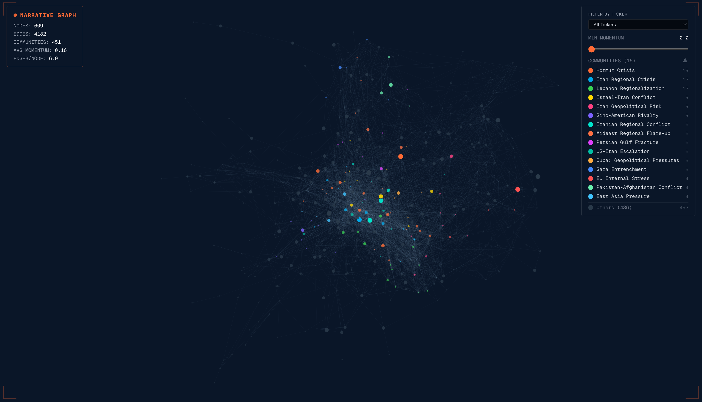
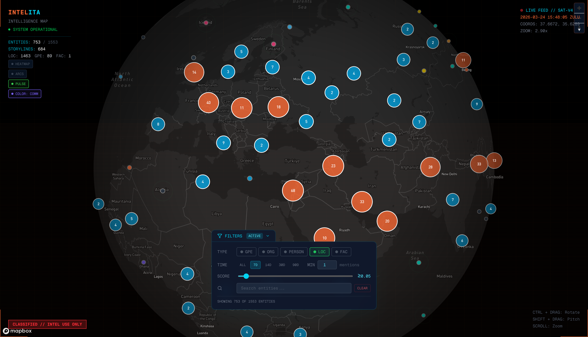
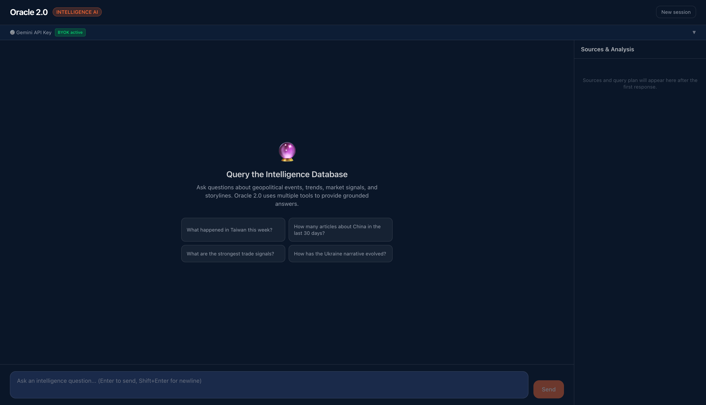

# MACROINTEL


End-to-end geopolitical intelligence platform: 56 RSS feeds + structured data (OpenSanctions, IMF WEO, World Bank, UCDP) → NLP → PostgreSQL/pgvector/PostGIS → Narrative Engine → Strategic Intelligence Layer (macro regime classification) → RAG + Chain-of-Verification → multi-provider LLM reports → FastAPI + Next.js frontend.

---

## Screenshots

| Narrative Graph | Intelligence Map | Oracle 2.0 |
|:-:|:-:|:-:|
|  |  |  |

---

## Architecture

```
RSS Feeds (56 sources) + Structured Data (OpenSanctions, UCDP, World Bank, IMF WEO)
    │
    ▼
Ingestion ── async aiohttp (parallel) ── Trafilatura → Scrapling → Newspaper3k
    │        2-phase deduplication      Filtro 1: keyword blocklist
    │        PDF auto-detection (2-level, pymupdf4llm)
    │
    ▼
NLP Processing ── spaCy xx_ent_wiki_sm (NER) ── 384-dim embeddings
    │              Filtro 2: LLM relevance classification (T5, Gemini Flash-Lite)
    │
    ▼
PostgreSQL 17 + pgvector (HNSW index) + PostGIS (Geospatial)
    │
    ▼
Narrative Engine ─────────────────────────────────────────────────────────────┐
    │  Stage 1: Micro-clustering (cosine sim > 0.90)                          │
    │  Stage 2: Adaptive matching (hybrid score: cosine + entity boost - decay)│
    │  Stage 3.5: Orphan buffer retry (14-day pool)                           │
    │  Stage 3: HDBSCAN discovery (orphan events → new storylines)            │
    │  Stage 4: LLM summary evolution (Gemini 2.5 Flash)                      │
    │  Stage 4b: Filtro 4 post-clustering validation (regex scope check)      │
    │  Stage 5: TF-IDF weighted Jaccard graph edges                           │
    │  Stage 6: Momentum decay (weekly ×0.7)                                 │
    │  + Louvain community detection (live) / k-means theme clustering (shadow)│
    └──────────────────────────────────────────────────────────────────────────┘
    │
    ▼
Strategic Intelligence Layer (src/macro/) — deterministic pre-LLM analysis
    │  34 macro indicators (FRED, yfinance, CME, BNR, Trading Economics)
    │  Convergence detection: 8 multivariate patterns, staleness-weighted confidence
    │  Supply-chain signal generation (sector map, confidence matrix)
    │  Regime persistence history (60-day streaks, momentum boost)
    │
    ▼
RAG + LLM Report Generation (2-call architecture, 5-tier LLM routing)
    │  Call #1 (T1, Gemini 3.1 Pro): macro regime classification — 7 Literal-constrained
    │      regimes, asset state map (P30/MA/σ coordinates), weighted causal hypotheses
    │  Call #2: strategic report — cross-validates macro hypotheses against OSINT articles
    │  Chain-of-Verification (CoVe) for hallucination prevention
    │  Multi-query expansion → HNSW vector search (top-20) → cross-encoder rerank → top-10
    │  Narrative context: top-10 storylines injected as XML
    │
    ├──▶ Trade Signals (Macro-first pipeline, T3 DeepSeek extraction)
    │        → Intelligence Scoring (0-100): LLM confidence - SMA200 penalty + PE score
    │
    ├──▶ Romania Vertical (dedicated relevance scoring + RO macro indicators)
    │
    └──▶ HITL Review (Streamlit dashboard)
             │
             ▼
         FastAPI backend (X-API-Key auth, slowapi rate limiting)
             │
             ▼
         Next.js 16 frontend (fully public)
             ├── /dashboard  (reports list + detail + comparison delta)
             ├── /map        (Mapbox GL PostGIS geospatial entity map)
             ├── /stories    (react-force-graph-2d narrative network)
             ├── /oracle     (Oracle 2.0 AI chat)
             └── /insights   (public intelligence briefings)

         Oracle 2.0 (AI Chat Engine — Claude Sonnet 4.6 agentic loop)
             ├── Anthropic Messages API with iterative tool_use/tool_result loop
             ├── 9 SOPs (FACTUAL/ANALYTICAL/OVERVIEW/MARKET/REFERENCE/NARRATIVE/TICKER/SPATIAL/COMPARATIVE)
             ├── Tools: RAG, SQL, Aggregation, Graph, Market, TickerThemes, ReportCompare,
             │          Reference (sanctions/forecasts/profiles), Spatial (PostGIS)
             └── ConversationMemory + TTL caching + anti-hallucination guard
```

---

## Project Structure

```
INTELLIGENCE_ITA/
├── config/
│   ├── feeds.yaml                        # 56 RSS feed definitions with categories
│   ├── llm_routing.yaml                  # 5-tier LLM factory configuration
│   ├── top_50_tickers.yaml               # Geopolitical market movers whitelist
│   ├── entity_blocklist.yaml             # Noise-filtering for extracted entities
│   ├── asset_theory_library.yaml         # 35 indicator ontologies + causal correlation maps
│   ├── macro_convergences.yaml           # 8 multivariate convergence pattern definitions
│   ├── sc_sector_map.yaml                # Supply chain sector → indicator mappings
│   ├── narrative_clustering.yaml         # Narrative Engine + theme clustering thresholds
│   ├── romania_geo_scope.yaml            # Romania vertical relevance scoring weights
│   └── pdf_sources.yaml                  # PDF intelligence sources (pymupdf4llm)
├── src/
│   ├── ingestion/
│   │   ├── feed_parser.py                # Async RSS/Atom parser (aiohttp, parallel)
│   │   ├── content_extractor.py          # Full-text extraction (Trafilatura → Scrapling → Newspaper3k)
│   │   ├── pdf_ingestor.py               # PDF extraction via pymupdf4llm → Markdown
│   │   └── pipeline.py                   # Orchestrated ingestion (Filtro 1 blocklist)
│   ├── nlp/
│   │   ├── processing.py                 # Text cleaning, section-aware chunking, NER, embeddings
│   │   ├── narrative_processor.py        # Narrative Engine (~1800 lines)
│   │   ├── relevance_filter.py           # Filtro 2: LLM relevance classification (global + Romania scope)
│   │   ├── config.py                     # Pydantic-validated clustering config loader
│   │   └── bullet_generator.py           # AI-extracted article bullet points
│   ├── storage/
│   │   └── database.py                   # DatabaseManager (~2700 lines), pgvector ops
│   ├── llm/
│   │   ├── llm_factory.py                # 5-tier multi-provider factory (Gemini/Claude/DeepSeek/Mistral)
│   │   ├── report_generator.py           # RAG pipeline + macro 2-call architecture (~4200 lines)
│   │   ├── oracle_orchestrator.py        # Oracle 2.0 agentic coordinator (Claude Sonnet 4.6)
│   │   ├── storyline_scoring.py          # Romania vertical 5-component relevance scoring
│   │   ├── query_analyzer.py             # Structured filter extraction from NL queries
│   │   ├── conversation_memory.py        # In-memory context deque (maxlen=10)
│   │   ├── schemas.py                    # Pydantic schemas for LLM structured output
│   │   └── tools/
│   │       ├── rag_tool.py               # Hybrid search + time-weighted decay + multi-query expansion
│   │       ├── sql_tool.py               # LLM-generated SQL with 5-layer safety
│   │       ├── aggregation_tool.py       # Pre-parametrized stats queries
│   │       ├── graph_tool.py             # Recursive CTE graph traversal
│   │       ├── market_tool.py            # Trade signals + macro indicators
│   │       ├── ticker_themes_tool.py     # Ticker → storylines correlation
│   │       ├── report_compare_tool.py    # LLM-synthesized report delta
│   │       ├── reference_tool.py         # Country profiles, IMF forecasts, sanctions (PII-sanitized view)
│   │       └── spatial_tool.py           # PostGIS spatial queries (template whitelist)
│   ├── macro/                            # Strategic Intelligence Layer
│   │   ├── match_convergences.py         # Multivariate convergence pattern matching engine
│   │   ├── build_sc_signals_context.py   # Deterministic supply-chain signal generation
│   │   ├── macro_regime_persistence.py   # 60-day regime history + streaks + momentum boost
│   │   ├── macro_analysis_schema.py      # LLM call #1 prompt: regime rules, coordinate reading
│   │   └── strategic_intelligence_prompt.py  # LLM call #2 assembler: 3-layer pre-analysis protocol
│   ├── api/
│   │   ├── main.py                       # FastAPI app, CORS, GZip, rate limiter
│   │   ├── auth.py                       # X-API-Key auth (secrets.compare_digest)
│   │   ├── routers/                      # dashboard, reports, stories, oracle, map, romania,
│   │   │                                 #   insights, waitlist, ingest
│   │   └── schemas/                      # Pydantic response models per router
│   ├── services/
│   │   ├── report_compare_service.py     # LLM delta analysis between two reports
│   │   └── ticker_service.py             # Ticker → storylines correlation
│   ├── finance/
│   │   ├── scoring.py                    # Intelligence score calculation (0-100)
│   │   ├── validator.py                  # ValuationEngine: metrics aggregation
│   │   └── constants.py                  # Score thresholds, sector benchmark map
│   ├── integrations/
│   │   ├── market_data.py                # Yahoo Finance (yfinance, OHLCV, SMA200)
│   │   └── openbb_service.py             # 34 macro indicators: FRED, yfinance, CME futures,
│   │                                     #   BNR/cursbnr scrape, Trading Economics, tvDatafeed
│   ├── hitl/
│   │   └── streamlit_utils.py            # Streamlit HITL shared utilities
│   └── utils/                            # Logging, ingestion stats, NER-aware stopwords
├── scripts/
│   ├── daily_pipeline.py                 # Orchestrator: 12 core steps + weekly/monthly conditional
│   ├── process_nlp.py                    # NLP processing (--scope ceseo for Romania vertical)
│   ├── load_to_database.py               # DB load + schema init
│   ├── process_narratives.py             # Narrative Engine step
│   ├── compute_communities.py            # Louvain (live) + Leiden/backbone 4-way shadow comparison
│   ├── theme_clustering.py               # k-means-on-embedding champion + HDBSCAN challenger (shadow)
│   ├── diagnose_clustering_signal.py     # Read-only clustering diagnostics (S1–S7 protocol)
│   ├── extract_entities.py               # NER entity extraction
│   ├── geocode_geonames.py               # Hybrid GeoNames+Gemini+Photon geocoder (primary)
│   ├── refresh_map_data.py               # Refresh map cache + recompute intelligence scores
│   ├── generate_report.py                # LLM report generation (global + Romania report types)
│   ├── fetch_daily_market_data.py        # Macro fetch (evening workflow, post-NYSE close)
│   ├── send_report_email.py              # Markdown → PDF → email dispatch (Brevo SMTP)
│   ├── recompute_macro_derived.py        # Resync derived macro columns after backfills
│   └── check_setup.py                    # System prerequisites check
├── migrations/                           # 43 incremental SQL files (through 046, applied via psql)
├── docs/architecture/                    # C4 + Mermaid diagrams (8 files, render on GitHub)
├── web-platform/                         # Next.js 16 frontend
│   ├── app/                              # dashboard, map, stories, oracle, insights routes
│   ├── components/                       # IntelligenceMap, StorylineGraph, report, landing
│   ├── hooks/                            # SWR hooks: useDashboard, useStories, useOracleChat, useMapData
│   └── middleware.ts                     # No-op passthrough (all routes public)
├── pages/                                # Streamlit HITL pages (briefing, scores, oracle admin,
│                                         #   clustering shadow comparison)
├── Home.py                               # Streamlit HITL entry point
├── Dockerfile / docker-compose.yml       # postgres, backend, frontend, nginx (+ photon profile)
├── requirements.txt
└── .env.example
```

---

## Prerequisites

| Requirement | Version | Notes |
|-------------|---------|-------|
| Python | 3.9+ (3.12 recommended) | Backend and pipeline |
| PostgreSQL | 14+ (17 in production) | With pgvector + PostGIS extensions |
| Node.js | 16+ | Next.js frontend |
| Docker + Compose | any recent | Production deploy only |

**Required environment variables** (see `.env.example`):

| Variable | Required | Description |
|----------|----------|-------------|
| `DATABASE_URL` | Yes | PostgreSQL connection string |
| `GEMINI_API_KEY` | Yes | Google Gemini (T1 reports, T4a/T5 NLP tasks) |
| `ANTHROPIC_API_KEY` | Yes | Claude Sonnet 4.6 (T2 — Oracle agentic loop) |
| `DEEPSEEK_API_KEY` | Yes | DeepSeek V3.2 (T3 — structured signal extraction) |
| `MISTRAL_API_KEY` | Yes | Mistral Codestral (T4b — SQL generation) |
| `INTELLIGENCE_API_KEY` | Yes (prod) | REST API shared secret |
| `FRED_API_KEY` | Optional | Federal Reserve Economic Data (macro indicators) |
| `ENVIRONMENT` | Optional | Set to `production` to enforce strict auth |
| `ALLOWED_ORIGINS` | Optional | CORS origins (default: localhost:3000) |
| `PHOTON_URL` | Optional | Self-hosted Photon geocoder (default: komoot.io API) |

---

## Quick Start — Development

### Backend

```bash
# From INTELLIGENCE_ITA/ (repo root)
python -m venv venv
source venv/bin/activate

pip install -r requirements.txt
python -m spacy download xx_ent_wiki_sm

cp .env.example .env
# Edit .env: set DATABASE_URL and the four LLM API keys

# Init database schema (first time only)
python scripts/load_to_database.py --init-only

# Apply all migrations
for f in migrations/*.sql; do psql -d intelligence_ita -f "$f"; done

# Verify setup
python scripts/check_setup.py

# Start FastAPI backend
uvicorn src.api.main:app --reload --host 0.0.0.0 --port 8000

# Start HITL review dashboard
streamlit run Home.py
```

### Frontend

```bash
# From web-platform/
npm install
npm run dev    # http://localhost:3000
```

---

## Production Deploy — Docker

Microservices architecture with observability stack: `postgres` (pgvector/PostGIS:pg17), `backend` (FastAPI), `frontend` (Next.js standalone), `nginx` (reverse proxy), optional `photon` (self-hosted geocoder, `--profile photon`).
Logs are managed via `promtail` and `loki`, and monitored in `grafana`.

```bash
cp .env.example .env
# Edit .env: set all required vars including INTELLIGENCE_API_KEY

docker compose up -d

# Check health
docker compose ps
docker compose logs backend --tail 50
```

**Scheduling:** The pipeline runs on Hetzner via **GitHub Actions**: `pipeline.yml` (daily at 8:00 UTC + manual trigger) and `evening_market_fetch.yml` (21:30 UTC Mon–Fri, after NYSE close). Deploy is triggered by push to `main` via `deploy.yml`; migrations via `migrate.yml`; LLM evals via `evals_fast.yml` (every PR, mocked) and `evals_nightly.yml` (real model).

---

## Pipeline

### Automated Daily Pipeline

```bash
python scripts/daily_pipeline.py
```

Twelve core steps + two conditional:

| Step | Name | Description | On failure |
|------|------|-------------|-----------|
| 1 | `ingestion` | Async RSS ingestion + full-text extraction (56 feeds) | Fail fast |
| 2 | `nlp_processing` | NER, embeddings, Filtro 2 relevance | Fail fast |
| 3 | `load_to_database` | Load enriched articles to PostgreSQL | Fail fast |
| 4 | `narrative_processing` | Narrative Engine (HDBSCAN + LLM + graph) | Continue |
| 5 | `community_detection` | Louvain (live) + 4-way Leiden/backbone shadow metrics | Continue |
| 6 | `theme_clustering_shadow` | k-means theme clustering (shadow columns only) | Continue |
| 7 | `entity_extraction` | NER entity extraction on recent articles | Continue |
| 8 | `geocoding` | Hybrid GeoNames + Gemini + Photon geocoding | Continue |
| 9 | `refresh_map_data` | Map cache invalidation + intelligence scores | Continue |
| 10 | `generate_report` | Macro 2-call analysis + RAG + strategic report | Fail fast |
| 11 | `generate_romania_report` | Romania vertical daily briefing | Continue |
| 12 | `send_report_email` | Markdown → PDF → email (Brevo SMTP) | Continue |
| 13* | `weekly_report` | Weekly meta-analysis | Sundays only |
| 14* | `monthly_recap` | Monthly recap | After 4 weekly reports |

Market data is fetched separately by `evening_market_fetch.yml` (21:30 UTC, post-NYSE close); morning reports read the previous session's close.

### Manual Step-by-Step

```bash
python -m src.ingestion.pipeline
python scripts/fetch_daily_market_data.py
python scripts/process_nlp.py
python scripts/load_to_database.py
python scripts/process_narratives.py --days 1
python scripts/compute_communities.py --min-weight 0.25 --resolution 0.8
python scripts/extract_entities.py --days 2
python scripts/geocode_geonames.py --limit 50
python scripts/refresh_map_data.py
python scripts/generate_report.py --macro-first --skip-article-signals
```

---

## Key Features

### 5-Tier Multi-Provider LLM Routing

Every LLM call is routed through `LLMFactory.get(tier)` (`src/llm/llm_factory.py`, config in `config/llm_routing.yaml`) — each task class gets the cheapest model that passes its quality bar:

| Tier | Model | Provider | Used for |
|------|-------|----------|----------|
| T1 | Gemini 3.1 Pro | Google | Macro analysis, strategic reports, report compare |
| T2 | Claude Sonnet 4.6 | Anthropic | Oracle 2.0 agentic loop + synthesis |
| T3 | DeepSeek V3.2 | OpenAI-compatible | Structured signal extraction (macro + article signals) |
| T4a | Gemini 2.5 Flash-Lite | Google | Query analysis, geocoding disambiguation |
| T4b | Mistral Codestral | OpenAI-compatible | SQL generation |
| T5 | Gemini 2.5 Flash-Lite | Google | NLP bulk: relevance filter, bullets, titles, community names |

Design details: all API keys `.strip()`-ped on read (CI secrets carry trailing newlines), per-tier timeouts (T5=15s … T1=120s) to prevent REST transport hangs, and a Pydantic retry shim for T3 (DeepSeek has no native `response_schema` enforcement — schema is injected as a prompt example and validated with a single retry).

### Strategic Intelligence Layer (`src/macro/`)

Deterministic macro analysis computed **before** any LLM call, so the model validates and enriches structured signals instead of hallucinating them:

- **34 macro indicators** fetched daily (`openbb_service.py`) from FRED, yfinance, CME futures, BNR/cursbnr scrape, Trading Economics, tvDatafeed — with derived historical coordinates per indicator: 7/30-day moving averages, σ(30d), Δ7d/Δ30d/Δ12m, and 30-day percentile rank (P30).
- **Convergence detection** (`match_convergences.py`): every indicator is matched against 8 multivariate patterns (e.g. `risk_off_systemic`, `recession_signal_leading`, `carry_trade_unwind_jpy`) defined in `config/macro_convergences.yaml`. Confidence is **staleness-weighted**: an indicator stale beyond its expected frequency contributes at half weight, beyond 3× at zero — but still counts in the denominator, keeping confidence honest.
- **Supply-chain signals** (`build_sc_signals_context.py`): sector-level signals derived from indicator moves via `config/sc_sector_map.yaml` causal mappings, with a confidence matrix that downgrades monthly-frequency indicators and requires a daily indicator for corroboration boosts.
- **2-call LLM architecture**:
  - **Call #1** (T1) classifies the macro regime into one of **7 Literal-constrained labels** (`risk_off_systemic` … `crisis_acute`, `stagflationary` — Pydantic rejects label drift), and produces an `asset_state_map` (per-asset position label from P30: oversold/neutral/overbought, trend direction, volatility regime) plus **weighted causal hypotheses** (PRIMARY/SECONDARY/STRUCTURAL, each with probability language and a forward-looking `osint_anchor`).
  - **Call #2** assembles the strategic report and **cross-validates** call #1's hypotheses against the day's OSINT articles — each market move discussed must be grounded in ≥2 of the three layers (ontology / trend coordinates / events), and every scenario must reference all three.
- **Regime persistence** (`macro_regime_persistence.py`): 60-day regime history with streak detection and supply-chain signal streaks, feeding a momentum boost (1.0–1.3×) back into narrative scoring.

### Narrative Engine

Tracks ongoing geopolitical storylines across articles using a 6-stage pipeline (`src/nlp/narrative_processor.py`):

1. **Micro-clustering** — groups near-duplicate articles (cosine sim > 0.90) into unique events
2. **Adaptive matching** — hybrid score (`cosine_sim - time_decay + entity_boost`) assigns events to existing storylines
3. **Orphan buffer retry** — re-matches events stored in `orphan_events` pool (14-day TTL) before HDBSCAN
4. **HDBSCAN discovery** — orphan events clustered into new storylines; noise points become individual threads
5. **LLM summary evolution** — Gemini 2.5 Flash generates/updates title + summary for each updated storyline
6. **Post-clustering validation (Filtro 4)** — archives storylines with no geopolitical scope keywords AND matching off-topic patterns
7. **TF-IDF weighted Jaccard graph** — edges upserted in `storyline_edges` (threshold 0.05 with IDF, 0.30 fallback); media/agency entities (Reuters, TASS, …) blocklisted at extraction time to avoid shared-source bias in edge weights
8. **Louvain community detection** — `scripts/compute_communities.py` assigns `community_id` + LLM-generated community names
9. **Momentum decay** — ×0.7 weekly for inactive storylines; archived after 30 days stabilized

**Storyline lifecycle:** `emerging` (< 3 articles) → `active` → `stabilized` → `archived`

Thresholds are externalized to `config/narrative_clustering.yaml` (Pydantic-validated loader in `src/nlp/config.py`):

| Constant | Default | Effect |
|----------|---------|--------|
| `MATCH_THRESHOLD` | 0.75 | Min hybrid score to match existing storyline |
| `MICRO_CLUSTER_THRESHOLD` | 0.90 | Cosine sim for near-duplicate grouping |
| `TIME_DECAY_FACTOR` | 0.05 | Score penalty per day of inactivity |
| `ENTITY_BOOST` | 0.10 | Bonus when entity Jaccard >= 0.30 |
| `MOMENTUM_DECAY_FACTOR` | 0.7 | Weekly decay multiplier |
| `ENTITY_JACCARD_THRESHOLD` | 0.05 | Min TF-IDF weighted Jaccard for graph edges |

### Clustering Research — Champion/Challenger with Shadow Validation

The community-detection layer is being migrated from graph-based to embedding-based clustering, using a measured, production-safe methodology:

- **Diagnostics first** (`scripts/diagnose_clustering_signal.py`): a read-only S1–S7 protocol characterizes both clustering layers on production data — hubness, in-space silhouette, whitening, 4-way co-association consensus, cross-space ARI/NMI, match-replay with dip-test threshold selection. Deterministic (fixed seeds), never writes to the DB.
- **4-way shadow comparison** (`compute_communities.py`): every run computes Louvain and Leiden-CPM partitions on both the full graph and a disparity-filter backbone (Serrano–Boguñá–Vespignani 2009), persisting all four as observation metrics (`narrative_run_metrics.shadow_partitions`) while only Louvain-full stays live. Includes an adaptive per-run γ-sweep for Leiden with a quality gate and a 3-level fallback.
- **Validated successor** (`scripts/theme_clustering.py`): k-means directly on storyline embeddings (384-dim) — production diagnostic showed silhouette **+0.171 vs −0.024 for live Louvain (Δ+0.195)**. Two-tier stability design: daily nearest-centroid assignment against a persistent centroid registry (`narrative_themes`), periodic warm-start re-fits with **Hungarian matching** for cross-run centroid lineage (merge/split tracking, dormant/re-emerging lifecycle). Drift detection against a rolling 30-day baseline triggers a k re-sweep only after 2 consecutive drift signals.
- **HDBSCAN as permanent challenger**: runs at every re-fit, writes only to a shadow column, never promotable (no warm-start support — it cannot satisfy the stability requirement).
- **Shadow rollout**: the k-means step runs daily in the pipeline writing only to shadow columns; promotion to the live `community_id` requires the validation triangle (stability / separation / fragmentation) to pass over 2 consecutive re-fits. A dedicated Streamlit page (`pages/5_Clustering_Shadow_Comparison.py`) visualizes the shadow metrics.

### 3-Layer Content Filtering

| Layer | Location | Method |
|-------|----------|--------|
| Filtro 1 | `src/ingestion/pipeline.py` | Keyword blocklist at ingestion (sports/entertainment/food) |
| Filtro 2 | `src/nlp/relevance_filter.py` | LLM classification (T5, JSON mode), conservative: borderline → RELEVANT. Scoped prompts: `global` (default) or `ceseo` (Romania economic) |
| Filtro 4 | `src/nlp/narrative_processor.py` | Post-clustering regex: lacks scope keywords AND matches off-topic pattern |

### Content Extraction — 4-Tier Fallback

| Tier | Method | Use case |
|------|--------|----------|
| 1 | Trafilatura | Primary — fast, news-optimized |
| 2 | Scrapling (curl_cffi) | WAF-protected sites (ISW, Chatham House, Times of Israel) |
| 2b | Scrapling StealthyFetcher | Cloudflare Turnstile (RUSI.org — Chromium-based, max 2 concurrent) |
| 3 | Newspaper3k | General fallback |
| 4 | Cloudscraper | Legacy anti-bot bypass |
| PDF | pymupdf4llm | Direct `.pdf` URLs + landing-page PDF links (2-level detection) |

Per-article extraction is wrapped in a 30s timeout with per-domain concurrency capped at 2 to avoid anti-bot triggering.

### RAG Pipeline

Two-stage retrieval for ~15–20% precision improvement over vector search alone:

- **Multi-query expansion** — generates 2–3 query variants from the original intent
- **Stage 1 (recall)** — HNSW approximate nearest neighbor on pgvector → top-20 chunks per query
- **Stage 2 (precision)** — Cross-encoder reranking `ms-marco-MiniLM-L-6-v2` → top-10 chunks

Narrative storyline context is injected as **XML** (top-10 active storylines by momentum) into the LLM prompt, enabling a dedicated **Strategic Storyline Tracker** report section.

### Oracle 2.0 — Claude Agentic Engine

NL query interface over the intelligence database (`POST /api/v1/oracle/chat`), built on the **Anthropic Messages API** with an iterative `tool_use`/`tool_result` loop (max 4 iterations):

```
User query
    ↓
Claude Sonnet 4.6 + system prompt encoding 9 Standard Operating Procedures
    (FACTUAL / ANALYTICAL / OVERVIEW / MARKET / REFERENCE / NARRATIVE / TICKER / SPATIAL / COMPARATIVE)
    ↓
Agentic tool loop (model decides which tools to call, iteratively)
    ├── RAGTool — hybrid search + time-weighted decay (exp(-k·days)), RRF multi-query fusion,
    │             cross-encoder + authority reranking
    ├── SQLTool — LLM-generated SQL with 5-layer safety (sqlparse → keywords → max 3 JOINs
    │             → LIMIT → EXPLAIN cost ≤10000 → 5s timeout) + few-shot SQL examples per table
    ├── AggregationTool — pre-parametrized stats (trend_over_time, top_n, distribution)
    ├── GraphTool — recursive CTE traversal on storyline_edges
    ├── MarketTool — trade signals + macro indicators
    ├── TickerThemesTool — ticker → correlated storylines
    ├── ReportCompareTool — LLM-synthesized delta between two reports
    ├── ReferenceTool — country profiles, IMF WEO forecasts (vintage-aware), sanctions search
    │                   (PII-sanitized view), trade flows
    └── SpatialTool — PostGIS queries via pre-approved template whitelist (no LLM SQL)
    ↓
Synthesis with Chain-of-Verification: when structured data and RAG context disagree on a
quantitative KPI, both values are annotated with sources instead of silently picking one
```

**Key design patterns:**
- Singleton instantiation (400 MB embedding model loaded once per process, thread-safe double-checked locking)
- Long tool outputs summarized for history by T5 (≤400 words, numbers/names preserved) — the loop never stalls
- All tools take a mandatory `rationale` first parameter (CoT forcing: +20–35% SQL accuracy on Spider/BIRD)
- Time-weighted decay: `score × exp(-k × days_old)`, k per intent (FACTUAL=0.03, ANALYTICAL=0.015, MARKET=0.04, OVERVIEW=0.005)
- TTL caching (SQL 5 min, embeddings 1 h) + anti-hallucination guard (structured "no data found")
- Rate limit: 3 queries/minute per IP

### Trade Signals & Intelligence Scoring

**Macro-first pipeline** (`--macro-first` flag):

1. Generate macro report → condense context to ~500 tokens
2. Extract report-level signals with T3 (high-conviction, multi-article synthesis)
3. Filter articles with whitelisted tickers
4. Extract article-level signals with macro alignment score

**Intelligence Score (0–100):**

```
base = llm_confidence × 100
     - SMA200 deviation penalty (0–40 pts, non-linear above 30%)
     + P/E valuation score (-20 to +10 pts)
```

Data sourced from Yahoo Finance (price, SMA200) and OpenBB v4 (P/E, sector, fundamentals).
Entity-level `intelligence_score` stored in `entities.intelligence_score` via `mv_entity_storyline_bridge` materialized view, refreshed by `scripts/refresh_map_data.py`.

### Romania Vertical

A parallel report line focused on Romania/CEE, sharing the same infrastructure with dedicated analytics:

- **5-component storyline relevance scoring** (`storyline_scoring.py`): direct presence (0.35) + regional Jaccard (0.25) + trade-route Jaccard (0.15) + source geography (0.15) + thematic keywords (0.10), weights in `config/romania_geo_scope.yaml`
- **1-hop graph expansion**: global storylines connected to Romania storylines (edge weight ≥ 0.25) are injected as `<global_context_via_graph>` so the report captures indirect dynamics (NATO, ECB, EU energy)
- **RO macro indicators** with custom sources: BNR policy rate, ROBOR 3M (cursbnr.ro daily scrape), RO 10Y yield and RO–DE spread (TradingView), CPI YoY (Trading Economics), EUR/RON
- Dedicated Italian-language daily/weekly briefings (`--report-type romania-daily|romania-weekly`), served at `/api/v1/romania/briefings`

### Geocoding — Hybrid GeoNames + Gemini + Photon

Entity geocoding uses a 4-step resolution pipeline (`scripts/geocode_geonames.py`):

1. **GeoNames lookup** — exact/ascii/alternate name match against local `geo_gazetteer` table (~2–3M rows from GeoNames dump via `scripts/load_geonames.py`)
2. **Gemini disambiguation** — when GeoNames returns >1 match, T4a CoT resolves spatial context → `{ reasoning, clean_name, country_code, feature_type }`
3. **Filtered GeoNames lookup** — uses Gemini output to narrow candidates
4. **Photon fallback** — for locations not in GeoNames (self-hosted Docker service via `--profile photon`, or komoot.io public API)

```bash
# Load GeoNames database (one-time, ~10–15 min)
python scripts/load_geonames.py --countries allCountries.txt --altnames alternateNames.txt

# Daily geocoding (top 200 un-geocoded entities)
python scripts/geocode_geonames.py --limit 200
```

### REST API

FastAPI backend at port 8000. Endpoints require `X-API-Key` header unless marked public. Rate limiting via slowapi. CORS allows `GET`/`OPTIONS` only — the API is read-only by design.

| Method | Path | Description |
|--------|------|-------------|
| GET | `/health` | Health check (public) |
| GET | `/api/v1/dashboard/stats` | Overview, articles, entities, quality KPIs |
| GET | `/api/v1/reports` | Paginated report list (filters: status, type, date range) |
| GET | `/api/v1/reports/{id}` | Full report: content, sources, feedback, metadata |
| GET | `/api/v1/reports/compare?ids=A,B` | LLM-synthesized delta between two reports |
| GET | `/api/v1/stories/graph` | Full narrative graph (nodes + edges + community stats) |
| GET | `/api/v1/stories/communities` | Community listing with key entities |
| GET | `/api/v1/stories/{id}` | Storyline detail + related storylines + recent articles |
| GET | `/api/v1/stories/{id}/network` | Ego network (node + direct neighbors) |
| GET | `/api/v1/map/entities` | GeoJSON FeatureCollection of geocoded entities |
| GET | `/api/v1/map/arcs` | GeoJSON LineStrings for entity co-occurrence arcs |
| GET | `/api/v1/map/stats` | Live HUD stats (entity counts, active storylines) |
| POST | `/api/v1/oracle/chat` | Oracle 2.0 NL query (rate limit: 3/min) |
| GET | `/api/v1/romania/macro` | RO macro indicators: latest + 90-day series (public) |
| GET | `/api/v1/romania/briefings` | Romania briefings list (public) |
| GET | `/api/v1/insights` | Public intelligence briefings list (public) |
| POST | `/api/v1/waitlist` | Register email for early access waitlist |

The frontend communicates through an internal proxy at `/api/proxy/[...path]` — no API key is exposed in the browser bundle.

### Web Frontend

Next.js 16 App Router, React 19, Tailwind CSS 4, Shadcn/ui (Radix), SWR, Framer Motion. **All routes are public** (`middleware.ts` is a no-op passthrough).

| Route | Description |
|-------|-------------|
| `/` | Landing page (stats counter, product showcase, waitlist) |
| `/insights` | Public intelligence briefings list |
| `/dashboard` | Intelligence reports list |
| `/dashboard/report/[id]` | Report detail + comparison dropdown (LLM delta analysis) |
| `/map` | Geospatial entity map (Mapbox GL, Tier 3 layers) — **temporarily disabled** (Work-in-Progress banner; components intact) |
| `/stories` | Narrative storyline force-graph (community coloring, momentum slider) |
| `/oracle` | Oracle 2.0 chat UI (sources sidebar) |
| `/romania` | Romania vertical: macro dashboard (sparklines) + briefing list |

**Tier 3 map layers** (toggle buttons in TacticalMap):

| Toggle | Description |
|--------|-------------|
| HEATMAP | Heatmap weighted by `intelligence_score` |
| ARCS | LineString co-occurrence arcs between entities sharing storylines (lazy-fetched) |
| PULSE | Animated ring on entities updated in last 48h |
| COLOR: COMM | Community-based coloring (shared 15-color palette with StorylineGraph) |

### HITL Review Dashboard

Streamlit multi-page dashboard (`streamlit run Home.py` → http://localhost:8501):

- **Daily Briefing**: view LLM draft, edit final version, star rating (1–5), save/approve workflow
- **Intelligence Scores**: scored trade signals with full breakdown (SMA200, P/E, valuation)
- **Oracle Admin**: Oracle 2.0 monitoring — active sessions, tool usage, latency percentiles
- **Clustering Shadow Comparison**: 4-way partition metrics dashboard for the clustering migration

---

## Testing

```bash
# All tests
pytest tests/ -v

# By marker
pytest -m unit              # fast, no DB required
pytest -m integration       # requires live DB
pytest -m "not slow"

# LLM evals (CI-specific)
pytest tests/evals/ -m eval_fast   # mocked model, runs on every PR
pytest tests/evals/ -m eval_slow   # real Gemini model, nightly only

# Coverage
pytest tests/ --cov=src --cov-report=html
```

Markers defined in `pytest.ini`: `unit`, `integration`, `e2e`, `slow`, `eval_fast`, `eval_slow`.
Mock HTTP with `responses`; mock datetime with `freezegun`; async tests with `pytest-asyncio`.

---

## Configuration Files

| File | Purpose |
|------|---------|
| `config/feeds.yaml` | 56 RSS feed definitions with categories and subcategories |
| `config/llm_routing.yaml` | 5-tier LLM factory: model, provider, timeout per tier |
| `config/top_50_tickers.yaml` | Geopolitical market movers (aliases for NER matching) |
| `config/entity_blocklist.yaml` | Noisy entity suppression (media artifacts, generic terms) |
| `config/asset_theory_library.yaml` | 35 indicator ontologies + causal correlation maps |
| `config/macro_convergences.yaml` | 8 multivariate convergence pattern definitions |
| `config/sc_sector_map.yaml` | Supply chain sector mappings with causal mechanisms |
| `config/narrative_clustering.yaml` | Narrative Engine + theme clustering thresholds |
| `config/romania_geo_scope.yaml` | Romania vertical scoring weights and entity sets |
| `config/pdf_sources.yaml` | PDF intelligence sources auto-detected via pymupdf4llm |
| `.env` | Runtime secrets and feature flags (see `.env.example`) |

---

## Tech Stack

| Layer | Technology |
|-------|-----------|
| LLM (reports/macro) | Google Gemini 3.1 Pro (T1) |
| LLM (agentic chat) | Anthropic Claude Sonnet 4.6 (T2) |
| LLM (extraction) | DeepSeek V3.2 (T3), Mistral Codestral (T4b) |
| LLM (NLP bulk) | Gemini 2.5 Flash-Lite (T4a/T5) |
| Embeddings | `paraphrase-multilingual-MiniLM-L12-v2` (384-dim) |
| Reranking | `cross-encoder/ms-marco-MiniLM-L-6-v2` |
| NLP | spaCy `xx_ent_wiki_sm` (multilingual) |
| Clustering | scikit-learn HDBSCAN + k-means (warm-start), scipy (Hungarian matching) |
| Community detection | python-louvain + networkx (live), leidenalg + igraph (shadow) |
| Vector DB | PostgreSQL 17 + pgvector (HNSW index) + PostGIS |
| Reliability | Chain-of-Verification (CoVe), Pydantic v2 structured output |
| Observability | Grafana, Loki, Promtail (Docker Compose) |
| Content extraction | Trafilatura, Scrapling (curl_cffi + Chromium), Newspaper3k |
| PDF extraction | pymupdf4llm (Markdown output) |
| Market & macro data | yfinance, OpenBB v4, FRED, Trading Economics, tvDatafeed, OpenSanctions, IMF WEO, UCDP |
| Backend | FastAPI + uvicorn + slowapi |
| HITL dashboard | Streamlit |
| Frontend | Next.js 16, React 19, Tailwind CSS 4 |
| Frontend libs | react-force-graph-2d, Mapbox GL, Shadcn/ui, SWR, Framer Motion |
| Infrastructure | Docker Compose, GitHub Actions (CI/CD), nginx, Hetzner CAX31 |

---

## Database Schema (Key Tables)

| Table | Purpose |
|-------|---------|
| `intelligence_sources` | Feed anagrafica: name, domain, authority_score (1-5), geo_region, cadence weights |
| `articles` | Full articles with NLP metadata, embeddings, `source_id` FK |
| `chunks` | 500-word sliding-window chunks with 384-dim embeddings for RAG |
| `reports` | Generated intelligence reports (draft/reviewed/approved) |
| `entities` | Named entities with geocoding + `intelligence_score` |
| `storylines` | Narrative threads: title, summary, momentum_score, status, `community_id` (+ shadow columns) |
| `storyline_edges` | Graph edges: TF-IDF weighted Jaccard weight, relation_type |
| `orphan_events` | Buffer pool for unmatched events (14-day TTL, retry on next run) |
| `narrative_themes` | Persistent k-means centroid registry (lifecycle, lineage, labels) |
| `narrative_run_metrics` | Per-run clustering observability: silhouette, modularity, TCS, shadow partitions |
| `macro_indicators` | Daily macro series with derived columns (MA, σ, Δ, percentile rank) |
| `macro_indicator_metadata` | Real data dates, staleness, reliability per indicator |
| `macro_regime_history` | 60-day regime classification history (Strategic Intelligence Layer) |
| `country_profiles` / `macro_forecasts` | Knowledge base: World Bank profiles, IMF WEO vintages |
| `v_sanctions_public` | PII-sanitized view over the OpenSanctions registry (Oracle-facing) |
| `conflict_events` | UCDP conflict events (PostGIS, queried by SpatialTool) |
| `trade_signals` | Extracted trade signals with intelligence scores |
| `oracle_query_log` | Oracle 2.0 query logging (intent, tools, latency, session_id) |

**Key views/materialized views:** `v_active_storylines`, `v_storyline_graph`, `entity_idf` (TF-IDF weights for the graph builder), `mv_entity_storyline_bridge` (intelligence score computation), `v_shadow_partitions_unnested` (clustering shadow dashboard).

---

## Development Status

| Phase | Status | Key Deliverables |
|-------|--------|-----------------|
| 1 — Ingestion | ✅ Complete | 56 RSS feeds, async aiohttp, 4-tier extraction, PDF, 2-phase dedup |
| 2 — NLP | ✅ Complete | spaCy NER, 384-dim embeddings, LLM relevance filter (Filtro 2) |
| 3 — Storage & RAG | ✅ Complete | pgvector HNSW, cross-encoder reranking, multi-query expansion |
| 4 — LLM Reports | ✅ Complete | Macro-first pipeline, trade signals, Pydantic schemas |
| 5 — HITL | ✅ Complete | Streamlit dashboard, rating/feedback loop |
| 6 — Narrative Engine | ✅ Complete | HDBSCAN, LLM evolution, TF-IDF Jaccard graph, 3-layer filtering, Louvain |
| 7 — API + Frontend | ✅ Complete | FastAPI (auth, rate limiting) + Next.js (map, stories, oracle) |
| 8 — Automation + Deploy | ✅ Complete | Docker Compose, nginx, GitHub Actions CI/CD, Hetzner deploy |
| 9 — Financial Intelligence | ✅ Complete | Intelligence scoring (0–100), Yahoo Finance, OpenBB fundamentals |
| 10 — Oracle 2.0 | ✅ Complete | Agentic tool loop, 9 tools, TTL caching, conversation memory |
| 11 — 5-Tier LLM Routing | ✅ Complete | Multi-provider factory (Gemini/Claude/DeepSeek/Mistral), Oracle → Claude Sonnet 4.6 |
| 12 — Knowledge Base | ✅ Complete | OpenSanctions (PII-sanitized), IMF WEO vintages, UCDP + PostGIS SpatialTool |
| 13 — Strategic Intelligence Layer | ✅ Complete | Convergence detection, SC signals, 7-regime classification, 2-call architecture |
| 14 — Romania Vertical | ✅ Complete | 5-component relevance scoring, RO macro sources, daily/weekly briefings |
| 15 — Clustering Upgrade | 🔄 Shadow period | k-means theme clustering champion (validated, Δ+0.195 silhouette), promotion pending |

---

## Performance Notes

| Stage | Typical Duration |
|-------|-----------------|
| RSS ingestion (56 feeds, async) | 30–60 s |
| Full-text extraction (concurrent, semaphore 10) | 60–90 s |
| NLP processing per article batch | ~2–3 min total |
| RAG vector search (HNSW, top-20) | ~50 ms |
| Cross-encoder reranking (top-10) | ~3–4 s |
| Report generation (2-call macro + strategic) | ~2–4 min |
| Oracle 2.0 query (agentic multi-tool) | ~5–15 s |

---

**Status:** Phases 1–14 complete, phase 15 (clustering upgrade) in shadow validation. Production-deployed on Hetzner CAX31 (8 GB ARM64).

**Last updated:** 2026-07-16
