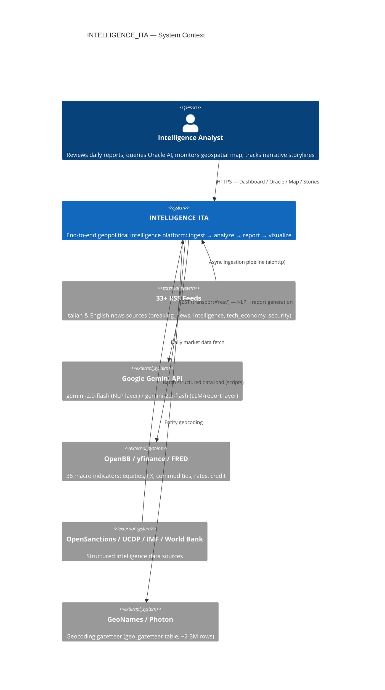
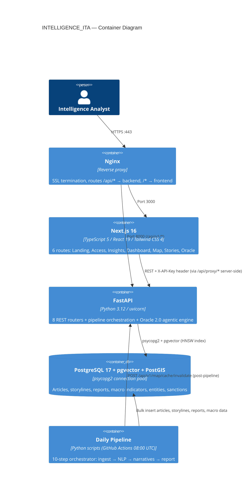

# INTELLIGENCE_ITA — Architecture Overview

## C4 Level 1: System Context

---

## C4 Level 2: Container Diagram

---

## Technology Stack Summary

| Layer | Technology | Version |
|-------|-----------|---------|
| **Frontend framework** | Next.js App Router | 16 |
| **Frontend UI** | React + Tailwind CSS + Shadcn/ui | 19 / 4 |
| **Frontend data fetching** | SWR | — |
| **Map visualization** | Mapbox GL | — |
| **Graph visualization** | react-force-graph-2d (Canvas 2D) | — |
| **Backend framework** | FastAPI + uvicorn | 0.128 / 0.40 |
| **Backend language** | Python | 3.12 |
| **NLP** | spaCy (xx_ent_wiki_sm) + sentence-transformers | 3.8 / 5.1 |
| **Embeddings model** | paraphrase-multilingual-MiniLM-L12-v2 | 384-dim |
| **Clustering** | scikit-learn HDBSCAN | — |
| **LLM** | Google Gemini (2.0-flash / 2.5-flash) | — |
| **Market data** | OpenBB v4 + yfinance | 4.6.0 |
| **Database** | PostgreSQL + pgvector + PostGIS | 17 / 0.4 |
| **Infrastructure** | Docker Compose on Hetzner CAX31 (ARM64) | — |
| **CI/CD** | GitHub Actions | — |
| **Monitoring** | Grafana + Loki + Promtail | — |
