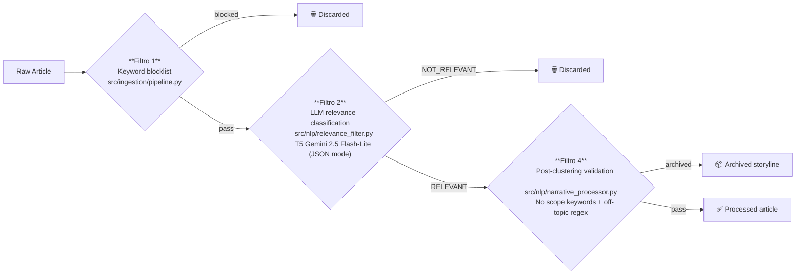

# Daily Pipeline Architecture

Orchestrated by `scripts/daily_pipeline.py`. Triggered daily at 08:00 UTC via GitHub Actions (`.github/workflows/pipeline.yml`). Market data is fetched by a separate evening workflow (`evening_market_fetch.yml`, 21:30 UTC Mon–Fri, post-NYSE close) — morning reports read the previous session's close.

## 12-Step Flow

```mermaid
flowchart TD
    START([GitHub Actions\n08:00 UTC daily]) --> S1

    S1["**Step 1: Ingestion**
    src/ingestion/pipeline.py
    Async RSS fetch (aiohttp TCPConnector limit=20) — 56 feeds
    4-tier extraction: Trafilatura → Scrapling → StealthyFetcher → Newspaper3k
    2-phase dedup: hash(link+title) → content_hash DB check
    Keyword blocklist Filtro 1
    timeout: 3600s"]

    S1 --> S2

    S2["**Step 2: NLP Processing**
    scripts/process_nlp.py → src/nlp/processing.py
    spaCy NER (xx_ent_wiki_sm)
    Sentence embeddings 384-dim (paraphrase-multilingual-MiniLM-L12-v2)
    Semantic chunking (500 words)
    Filtro 2: LLM relevance (T5, Gemini 2.5 Flash-Lite, JSON mode)
    Output: JSON with entities + chunks + embeddings"]

    S2 --> S3

    S3["**Step 3: Load to Database**
    scripts/load_to_database.py
    Bulk insert: articles + chunks + entities + embeddings
    PostgreSQL + pgvector (HNSW index)"]

    S3 --> S4

    S4["**Step 4: Narrative Processing** ⚠️ continue_on_failure
    scripts/process_narratives.py → src/nlp/narrative_processor.py
    6-stage pipeline (see 02_narrative_engine.md)
    timeout: 1800s"]

    S4 --> S5

    S5["**Step 5: Community Detection** ⚠️ continue_on_failure
    scripts/compute_communities.py
    Louvain (python-louvain + networkx) — LIVE writer of community_id
    + 4-way shadow metrics: Louvain/Leiden × full/backbone
      (narrative_run_metrics.shadow_partitions)
    T5 Flash-Lite → community_name
    timeout: 600s"]

    S5 --> S5b

    S5b["**Step 6: Theme Clustering Shadow** ⚠️ continue_on_failure
    scripts/theme_clustering.py
    k-means on storyline embeddings (champion, validated Δ+0.195 silhouette)
    + HDBSCAN challenger
    Writes ONLY shadow columns (community_id_kmeans_shadow / community_id_shadow)
    Live community_id stays Louvain's until promotion"]

    S5b --> S6

    S6["**Step 7: Entity Extraction** ⚠️ continue_on_failure
    scripts/extract_entities.py
    Geocodable entity candidates
    timeout: 600s"]

    S6 --> S7

    S7["**Step 8: Geocoding** ⚠️ continue_on_failure
    scripts/geocode_geonames.py
    4-step hybrid: GeoNames gazetteer → Gemini (T4a) → Photon → PostGIS
    Requires geo_gazetteer table (migration 023 + load_geonames.py)
    timeout: 1200s"]

    S7 --> S8

    S8["**Step 9: Refresh Map Data** ⚠️ continue_on_failure
    scripts/refresh_map_data.py
    REFRESH MATERIALIZED VIEW entity_idf
    REFRESH MATERIALIZED VIEW mv_entity_storyline_bridge
    Recompute intelligence_score on entities
    Invalidate GeoJSON cache (POST /api/v1/map/cache/invalidate)
    timeout: 300s"]

    S8 --> S9

    S9["**Step 10: Generate Report**
    scripts/generate_report.py --macro-first --skip-article-signals
    2 LLM calls (see report generation flow below)
    timeout: 1800s"]

    S9 --> S10

    S10["**Step 11: Romania Report** ⚠️ continue_on_failure
    scripts/generate_report.py --report-type romania-daily
    Romania relevance scoring + RO macro header + 1-hop graph expansion"]

    S10 --> S11

    S11["**Step 12: Send Report Email** ⚠️ continue_on_failure
    scripts/send_report_email.py
    Markdown → HTML → PDF (weasyprint) → Brevo SMTP"]

    S11 --> COND{Sunday?}
    COND -- Yes --> WEEKLY["Weekly Report
    generate_weekly_report.py"]
    COND -- No --> DONE
    WEEKLY --> MONTHLY{4 weekly reports\nsince last recap?}
    MONTHLY -- Yes --> RECAP["Monthly Recap
    generate_recap_report.py"]
    MONTHLY -- No --> DONE
    RECAP --> DONE([Pipeline complete])
```

---

## Report Generation Flow (Step 10 Detail)

`src/llm/report_generator.py`

```mermaid
flowchart TD
    IN([macro_indicators + articles + storylines]) --> MC

    MC["**Macro Context Assembly (deterministic, pre-LLM)**
    OntologyManager.build_jit_context() — top anomalies
    match_convergences() — 8 multivariate patterns, staleness-weighted
    build_sc_signals_context() — supply chain signals
    MacroRegimePersistence — 60-day regime history
    Historical coordinates per indicator: MA7/30, σ30, Δ7d/30d/12m, P30 percentile"]

    MC --> LLM1

    LLM1["**LLM Call #1: Macro Analysis**
    Model: T1 Gemini 3.1 Pro (timeout: 180s, 1 retry)
    Input: macro snapshot + JIT asset theory + convergences + SC signals
    Output: MacroAnalysisResultV2 (Pydantic)
    → risk_regime label (7 Literal-constrained values) + confidence
    → asset_state_map (position from P30: oversold/neutral/overbought)
    → causal_hypotheses (PRIMARY/SECONDARY/STRUCTURAL + osint_anchor)
    → Persisted to macro_regime_history table"]

    LLM1 --> RAG

    RAG["**RAG Pipeline**
    Multi-query expansion (2-3 variants)
    Vector search HNSW (top-20 per query, chunks table)
    Cross-encoder reranking ms-marco-MiniLM-L-6-v2 → top-10
    ~15-20% precision improvement over pure vector search"]

    RAG --> NAR

    NAR["**Narrative Context**
    Fetch top-10 storylines by momentum from v_active_storylines
    Format as XML: Strategic Storyline Tracker
    Includes: title, summary, momentum, key_entities, connected storylines, linked articles"]

    NAR --> LLM2

    LLM2["**LLM Call #2: Strategic Report**
    Model: gemini-2.5-flash with system_instruction
    Input: Call #1 output + regime history XML + raw indicator coordinates
           + RAG chunks + narrative XML + OSINT articles
    Cross-validation: every market move grounded in ≥2 of 3 layers
    (ontology / trend coordinates / events); osint_anchor hypotheses
    resolved against today's articles
    Output: 7-section Strategic Intelligence Report
    Sections: Executive Summary, Key Developments, Macro Dashboard,
              Early Warning (1-4w), Strategic Positioning (1-6m),
              Scenario Analysis (3-12m), Supply Chain Monitor,
              Strategic Storyline Tracker"]

    LLM2 --> SIG

    SIG["**Trade Signal Extraction**
    T3 DeepSeek V3.2 structured extraction (Pydantic retry shim)
    BULLISH/BEARISH/NEUTRAL/WATCHLIST signals
    Score = LLM confidence − SMA200 penalty + PE valuation
    Save to trade_signals table"]

    SIG --> OUT([Report saved to DB + reports/{timestamp}.md])
```

---

## Content Filtering (3 Layers)

```mermaid
flowchart LR
    ART[Raw Article] --> F1

    F1{"**Filtro 1**
    Keyword blocklist
    src/ingestion/pipeline.py"}
    F1 -- blocked --> BIN1[🗑 Discarded]
    F1 -- pass --> F2

    F2{"**Filtro 2**
    LLM relevance classification
    src/nlp/relevance_filter.py
    T5 Gemini 2.5 Flash-Lite (JSON mode)"}
    F2 -- NOT_RELEVANT --> BIN2[🗑 Discarded]
    F2 -- RELEVANT --> F4

    F4{"**Filtro 4**
    Post-clustering validation
    src/nlp/narrative_processor.py
    No scope keywords + off-topic regex"}
    F4 -- archived --> BIN4[📦 Archived storyline]
    F4 -- pass --> OK[✅ Processed article]
```
