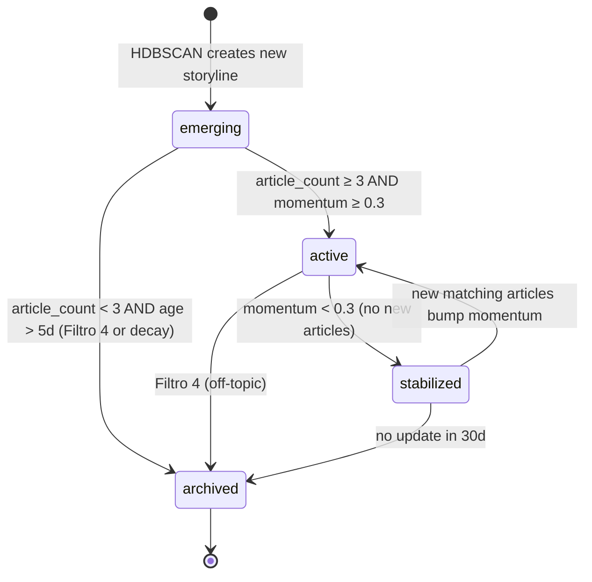
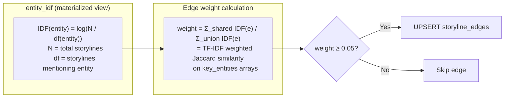

# Narrative Engine — Internal Architecture

`src/nlp/narrative_processor.py` (~1498 lines)

The Narrative Engine tracks geopolitical storylines across articles using a 6-stage pipeline. It runs as Step 5 of the daily pipeline.

## 6-Stage Pipeline

```mermaid
flowchart TD
    IN(["**Input**
    Articles with embeddings
    from last 24h
    src/storage/database.py"])

    IN --> S1

    S1["**Stage 1: MICRO-CLUSTERING**
    Group near-duplicate articles into events
    Cosine similarity threshold: 0.90
    Merges: article_ids, entities, embeddings (centroid)
    Output: List of event dicts"]

    S1 --> S2

    S2["**Stage 2: ADAPTIVE MATCHING**
    Load active storylines (emerging + active)
    Hybrid match score per event-storyline pair:
    score = cosine_sim(event_emb, storyline_emb)
          − time_decay(days_since_last_update)
          + entity_boost(shared_entities)
    Match threshold: ≥ 0.75
    → Update article_storylines + momentum_score"]

    S2 --> S35

    S35["**Stage 3.5: ORPHAN BUFFER RETRY**
    Re-attempt matching for events in orphan_events table
    14-day TTL pool (migration 018)
    Reduces noise feeding into HDBSCAN
    Expired events pruned"]

    S35 --> S3

    S3["**Stage 3: HDBSCAN DISCOVERY**
    Input: unmatched orphaned events
    HDBSCAN(metric='euclidean', min_cluster_size=2)
    Noise points (label=-1) → individual new storylines
    Cluster → merged storyline (new or updated)
    narrative_status = 'emerging', momentum = 0.5"]

    S3 --> S4

    S4["**Stage 4: LLM SUMMARY EVOLUTION**
    Model: gemini-2.0-flash (timeout: 30s)
    Italian-language prompt
    For each new/updated storyline:
    → Generate/refine title + summary
    → Compute summary_vector (384-dim embedding)
    → Update storylines.title, .summary, .summary_vector
    Encoding fallback: skip LEFT(full_text,200) snippet on UTF-8 error"]

    S4 --> S4b

    S4b["**Stage 4b: FILTRO 4 (Post-clustering validation)**
    Archive condition (AND):
    1. No scope keywords in title/summary
       (geopolitical, military, economic, diplomatic...)
    2. Matches off-topic regex patterns
       (sports, entertainment, food, lifestyle...)
    → narrative_status = 'archived'"]

    S4b --> S5

    S5["**Stage 5: TF-IDF JACCARD GRAPH BUILDER**
    For each storyline pair (emerging + active + stabilized):
    weight = Σ(IDF(entity) × presence_indicator) / union_size
    Source: entity_idf materialized view
    Edge threshold: 0.05 (with TF-IDF), 0.30 (without)
    → UPSERT storyline_edges table
    relation_type: 'thematic_overlap'"]

    S5 --> S6

    S6["**Stage 6: MOMENTUM DECAY**
    Rules applied in order:
    ① emerging/active, no update in 7d: momentum *= 0.7
    ② active + momentum < 0.3 → stabilized
    ③ stabilized, no update in 30d → archived
    ④ emerging, article_count < 3, age > 5d → archived"]

    S6 --> OUT(["**Output**
    Updated: storylines
    Updated: article_storylines
    Updated: storyline_edges
    Updated: orphan_events (expired pruned)"])
```

---

## Storyline Status State Machine

---

## Graph Edge Weighting (TF-IDF Jaccard)

---

## Views Used by Narrative Engine

| View | Filter | Used In |
|------|--------|---------|
| `v_active_storylines` | status IN ('emerging','active','stabilized') ORDER BY momentum DESC | Stage 2 matching, RAG context injection |
| `v_storyline_graph` | Edges between non-archived storylines + titles | API /stories/graph endpoint |
| `entity_idf` (materialized) | IDF weights for all entities | Stage 5 graph builder |
| `mv_entity_storyline_bridge` (materialized) | Per-entity: storyline count, max momentum, bridge score | intelligence_score computation |
