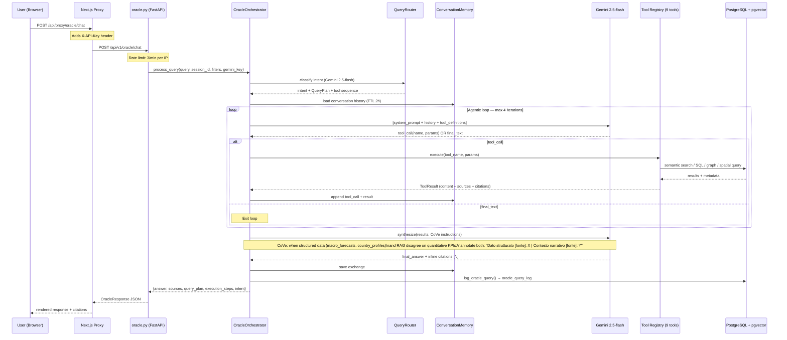
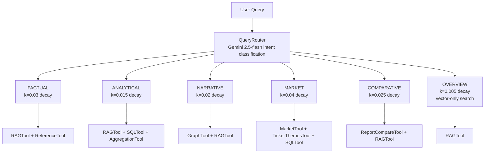
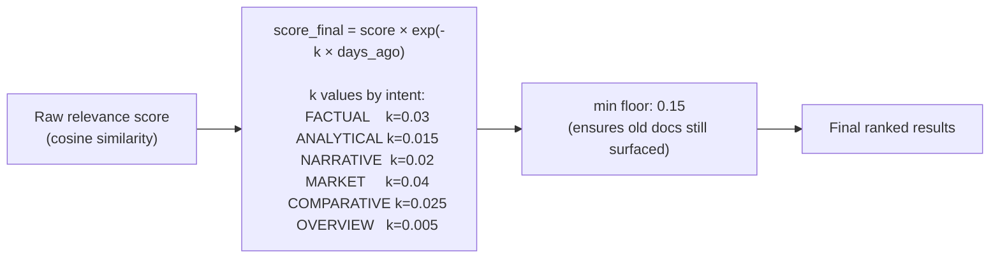
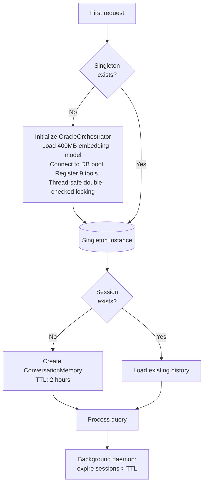

# Oracle 2.0 — Agentic Engine Architecture

`src/llm/oracle_orchestrator.py` — singleton via `get_oracle_orchestrator_singleton()`

Oracle 2.0 is a native Gemini function-calling agentic engine with iterative tool use, session memory, time-weighted RAG, and Chain-of-Verification (CoVe) synthesis.

## Agentic Loop — Sequence Diagram

---

## Intent Classification → Tool Routing

`src/llm/query_router.py` classifies into 6 intent types, each with a different tool sequence and RAG decay constant:

---

## Tool Registry — 9 Tools

```mermaid
flowchart LR
    subgraph Tools["Tool Registry (src/llm/tools/)"]
        RAG["**RAGTool**
        Hybrid vector+FTS search
        Over-fetch 3× top-K (anti-bias)
        Time-weighted: score × exp(-k × days)
        Min floor: 0.15
        Authority reranking (intelligence_sources.authority_score)
        Historical query: reference_date = end_date"]

        SQL["**SQLTool**
        5-layer safety:
        1. ALLOWED_TABLES whitelist
        2. Forbidden keywords
        3. Max 3 JOINs
        4. LIMIT enforcement
        5. EXPLAIN cost ≤ 10000
        Timeout: 5s statement_timeout
        Uses v_sanctions_public (not raw table)"]

        AGG["**AggregationTool**
        Macro-level trend summarization
        Time-series aggregation
        Delta computation"]

        GRAPH["**GraphTool**
        Narrative graph queries
        Storyline neighbors + communities
        Ego network traversal"]

        MKT["**MarketTool**
        Ticker OHLCV prices
        Fundamentals (PE, sector)
        Market sentiment from articles"]

        TICK["**TickerThemesTool**
        Theme clustering per ticker
        Sentiment from recent articles
        Whitelisted tickers only"]

        RPT["**ReportCompareTool**
        Delta analysis between 2 reports
        Gemini 2.5-flash synthesis
        4 sections: new, resolved, shifted, persistent"]

        REF["**ReferenceTool**
        Cite articles/reports with URL + metadata
        Safe queries (pre-approved SQL patterns)
        Uses v_sanctions_public"]

        SPAT["**SpatialTool**
        PostGIS queries on entities
        Conflict events (UCDP GED)
        ST_DWithin, ST_Intersects"]
    end
```

---

## Time-Weighted Decay (RAGTool)

---

## Singleton & Session Management

