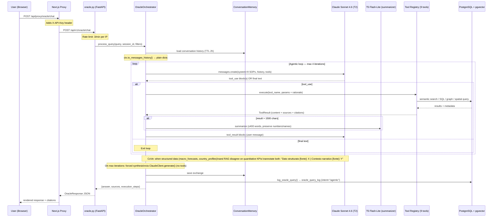
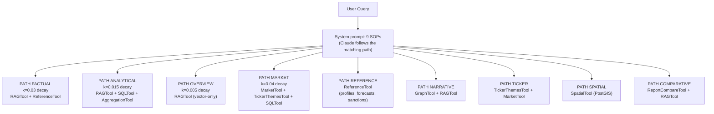
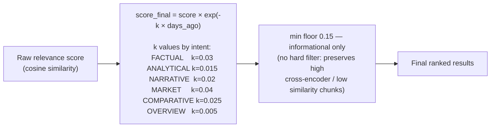
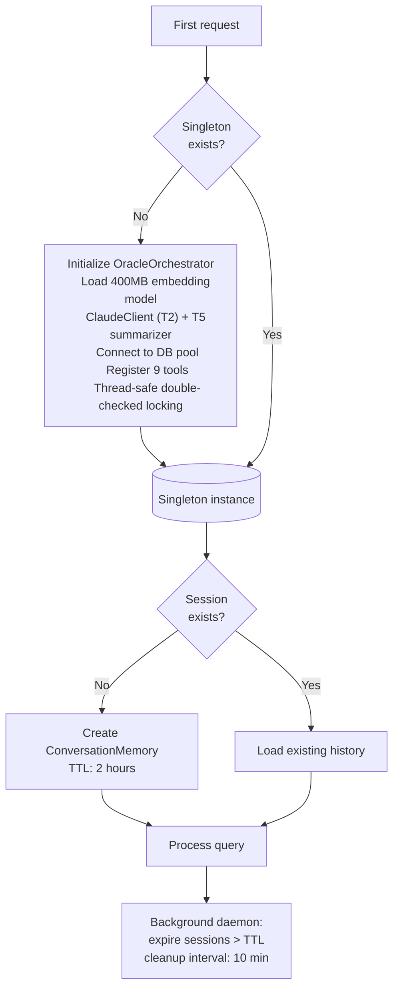

# Oracle 2.0 — Agentic Engine Architecture

`src/llm/oracle_orchestrator.py` — singleton via `get_oracle_orchestrator_singleton()`

Oracle 2.0 is a **Claude Sonnet 4.6 agentic engine** (Anthropic Messages API, iterative `tool_use`/`tool_result` loop) with session memory, time-weighted RAG, and Chain-of-Verification (CoVe) synthesis. Routing logic is encoded as 9 Standard Operating Procedures (SOPs) in the system prompt — the model itself decides which tools to call at each iteration (no separate router LLM call).

## Agentic Loop — Sequence Diagram

```mermaid
sequenceDiagram
    participant U as User (Browser)
    participant PROXY as Next.js Proxy
    participant API as oracle.py (FastAPI)
    participant OO as OracleOrchestrator
    participant MEM as ConversationMemory
    participant Claude as Claude Sonnet 4.6 (T2)
    participant T5 as T5 Flash-Lite (summarizer)
    participant Tools as Tool Registry (9 tools)
    participant DB as PostgreSQL + pgvector

    U->>PROXY: POST /api/proxy/oracle/chat
    Note over PROXY: Adds X-API-Key header
    PROXY->>API: POST /api/v1/oracle/chat
    Note over API: Rate limit: 3/min per IP
    API->>OO: process_query(query, session_id, filters)

    OO->>MEM: load conversation history (TTL 2h)
    Note over OO: ctx.to_messages_history() → plain dicts

    loop Agentic loop — max 4 iterations
        OO->>Claude: messages.create(system=9 SOPs, history, tools)
        Claude-->>OO: tool_use block(s) OR final text

        alt tool_use
            OO->>Tools: execute(tool_name, params + rationale)
            Tools->>DB: semantic search / SQL / graph / spatial query
            DB-->>Tools: results + metadata
            Tools-->>OO: ToolResult (content + sources + citations)
            alt result > 1500 chars
                OO->>T5: summarize (≤400 words, preserve numbers/names)
            end
            OO->>Claude: tool_result blocks (user message)
        else final text
            Note over OO: Exit loop
        end
    end

    Note over OO,Claude: CoVe: when structured data (macro_forecasts, country_profiles)\nand RAG disagree on quantitative KPIs:\nannotate both: "Dato strutturato [fonte]: X | Contesto narrativo [fonte]: Y"
    Note over OO: On max iterations: forced synthesis\nvia ClaudeClient.generate() (no tools)

    OO->>MEM: save exchange
    OO->>DB: log_oracle_query() → oracle_query_log (intent="agentic")
    OO-->>API: {answer, sources, execution_steps}
    API-->>PROXY: OracleResponse JSON
    PROXY-->>U: rendered response + citations
```

---

## Standard Operating Procedures → Tool Routing

The system prompt encodes 9 SOPs, each prescribing a tool sequence and an intent-based RAG time-decay constant. The legacy `QueryRouter` LLM classification step was removed — SOPs are followed natively by the agentic model:

```mermaid
flowchart TD
    Q[User Query] --> SP["System prompt: 9 SOPs\n(Claude follows the matching path)"]

    SP --> FACT["PATH FACTUAL\nk=0.03 decay\nRAGTool + ReferenceTool"]
    SP --> ANAL["PATH ANALYTICAL\nk=0.015 decay\nRAGTool + SQLTool + AggregationTool"]
    SP --> OVW["PATH OVERVIEW\nk=0.005 decay\nRAGTool (vector-only)"]
    SP --> MKT["PATH MARKET\nk=0.04 decay\nMarketTool + TickerThemesTool + SQLTool"]
    SP --> REFP["PATH REFERENCE\nReferenceTool\n(profiles, forecasts, sanctions)"]
    SP --> NARP["PATH NARRATIVE\nGraphTool + RAGTool"]
    SP --> TICK["PATH TICKER\nTickerThemesTool + MarketTool"]
    SP --> SPATP["PATH SPATIAL\nSpatialTool (PostGIS)"]
    SP --> COMP["PATH COMPARATIVE\nReportCompareTool + RAGTool"]
```

---

## Tool Registry — 9 Tools

All tools take a mandatory `rationale` first parameter (CoT forcing — empirical +20–35% SQL accuracy on Spider/BIRD benchmarks).

```mermaid
flowchart LR
    subgraph Tools["Tool Registry (src/llm/tools/)"]
        RAG["**RAGTool**
        Hybrid vector+FTS search
        Over-fetch 3× top-K (anti-bias)
        Time-weighted: score × exp(-k × days)
        RRF multi-query fusion → cross-encoder
        Authority reranking (intelligence_sources.authority_score)
        Historical query: reference_date = end_date"]

        SQL["**SQLTool**
        LLM-generated SQL (T4b Mistral Codestral)
        + few-shot examples per table
        5-layer safety:
        1. sqlparse token-level detection
        2. Forbidden keywords
        3. Max 3 JOINs
        4. LIMIT enforcement
        5. EXPLAIN cost ≤ 10000
        Timeout: 5s statement_timeout
        Uses v_sanctions_public (not raw table)"]

        AGG["**AggregationTool**
        Pre-parametrized stats queries
        trend_over_time, top_n, distribution
        Delta computation"]

        GRAPH["**GraphTool**
        Narrative graph queries
        Storyline neighbors + communities
        Recursive CTE traversal"]

        MKT["**MarketTool**
        Trade signals + macro indicators
        Ticker OHLCV prices
        Fundamentals (PE, sector)"]

        TICK["**TickerThemesTool**
        Ticker → correlated storylines
        Sentiment from recent articles
        Whitelisted tickers only"]

        RPT["**ReportCompareTool**
        Delta analysis between 2 reports
        LLM-synthesized (T1)
        4 sections: new, resolved, shifted, persistent"]

        REF["**ReferenceTool**
        8 parameterized lookups (no LLM SQL):
        country profiles, IMF WEO forecasts
        (vintage-aware), sanctions search
        (v_sanctions_public, PII-sanitized),
        trade flows. 10s statement timeout"]

        SPAT["**SpatialTool**
        PostGIS queries via pre-approved
        template whitelist (no LLM SQL)
        Conflict events (UCDP GED)
        ST_DWithin, ST_Intersects
        SpatialQuerySpec Pydantic validation"]
    end
```

---

## Time-Weighted Decay (RAGTool)

```mermaid
flowchart LR
    RAW["Raw relevance score\n(cosine similarity)"] --> DECAY

    DECAY["score_final = score × exp(-k × days_ago)
    
    k values by intent:
    FACTUAL    k=0.03
    ANALYTICAL k=0.015
    NARRATIVE  k=0.02
    MARKET     k=0.04
    COMPARATIVE k=0.025
    OVERVIEW   k=0.005"]

    DECAY --> FLOOR["min floor 0.15 — informational only\n(no hard filter: preserves high\ncross-encoder / low similarity chunks)"]
    FLOOR --> RANK[Final ranked results]
```

---

## Singleton & Session Management

```mermaid
flowchart TD
    FIRST[First request] --> CHECK{Singleton\nexists?}
    CHECK -- No --> INIT["Initialize OracleOrchestrator
    Load 400MB embedding model
    ClaudeClient (T2) + T5 summarizer
    Connect to DB pool
    Register 9 tools
    Thread-safe double-checked locking"]
    INIT --> SING[(Singleton instance)]
    CHECK -- Yes --> SING

    SING --> SESSION{Session\nexists?}
    SESSION -- No --> NEW[Create ConversationMemory\nTTL: 2 hours]
    SESSION -- Yes --> LOAD[Load existing history]

    NEW & LOAD --> PROC[Process query]
    PROC --> CLEANUP[Background daemon:\nexpire sessions > TTL\ncleanup interval: 10 min]
```

**Note (2026-04-17):** BYOK was removed — Oracle uses the server-side `ANTHROPIC_API_KEY` exclusively; passing a `gemini_api_key` in the request body returns HTTP 422.
