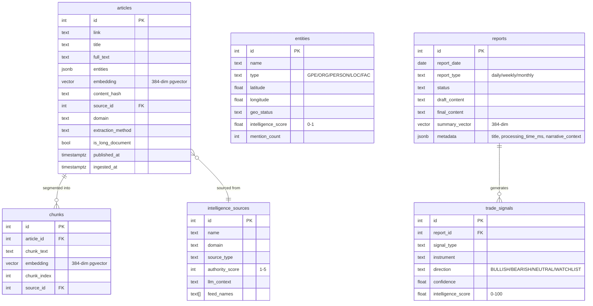
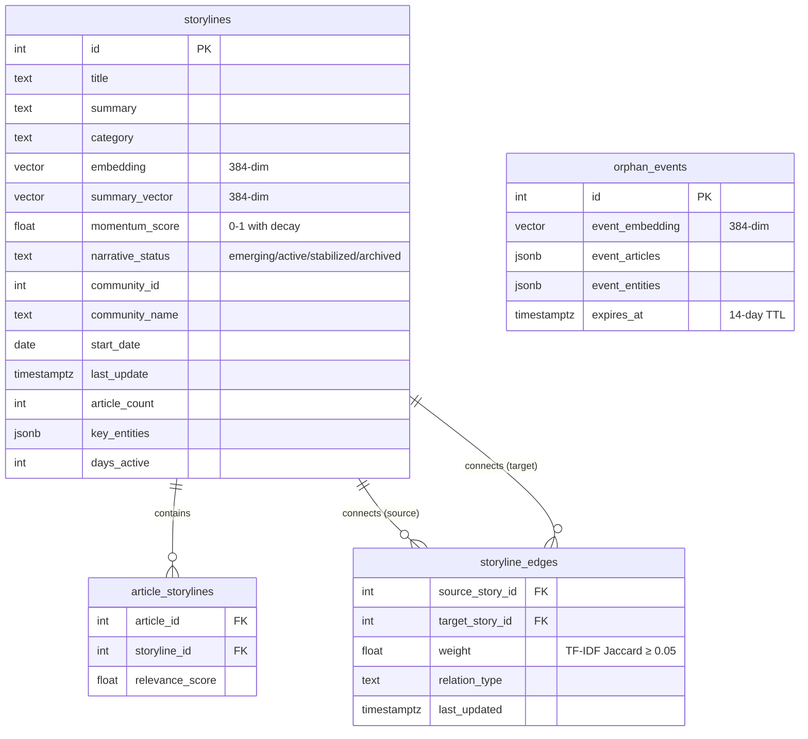
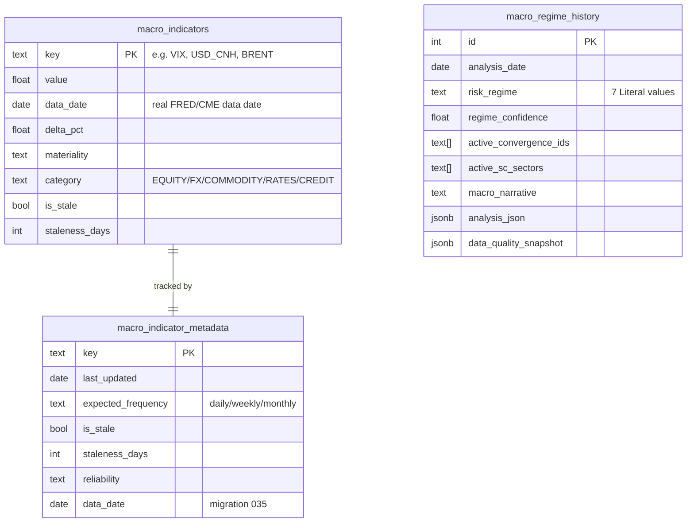
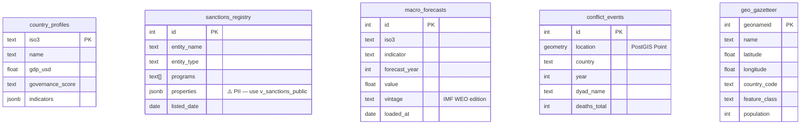

# Database Schema

PostgreSQL 17 + pgvector (0.4.1) + PostGIS. 35 migrations applied as of 2026-04-14.

## Core Tables — ER Diagram

---

## Narrative Engine Tables

---

## Macro Intelligence Tables

---

## Knowledge Base Tables (Migrations 026+)

---

## Views & Materialized Views

| Name | Type | Filter | Primary Consumers |
|------|------|--------|------------------|
| `v_active_storylines` | View | status IN ('emerging','active','stabilized') ORDER BY momentum DESC | Narrative engine Stage 2, report generator, API /stories |
| `v_storyline_graph` | View | Edges between non-archived storylines + titles | API /stories/graph |
| `v_sanctions_public` | View | Strips PII columns from sanctions_registry | SQLTool, ReferenceTool (NEVER use raw table) |
| `entity_idf` | Materialized | IDF(entity) = log(N/df) across all storylines | Narrative engine Stage 5 (TF-IDF Jaccard) |
| `mv_entity_storyline_bridge` | Materialized | Per-entity: storyline_count, max_momentum, bridge_score | intelligence_score computation in refresh_map_data.py |

**Refresh cadence:** Both materialized views are refreshed by `scripts/refresh_map_data.py` (pipeline Step 9) after each run.

---

## Migration History

| Range | Key Changes |
|-------|------------|
| 001-007 | content_hash, report_type, PostGIS coordinates, market schema, trade_signals, report embeddings, FTS indexes |
| 008-012 | Storylines + narrative engine, OpenBB macro schema, financial intelligence v2, audit trail, narrative graph edges |
| 013-019 | oracle_query_log, users, waitlist, knowledge base (country_profiles, sanctions, forecasts, conflict_events), geo_gazetteer, intelligence_sources, mv_entity_storyline_bridge |
| 020-025 | Community detection (community_id), community_name, geo_gazetteer GIN index, GeoNames alternates, intelligence_sources v2, chunks.source_id |
| 026-034 | Structured intelligence (UCDP, OpenSanctions, IMF WEO, World Bank), v_sanctions_public PII view |
| 035 | macro_indicator_metadata + macro_regime_history (Strategic Intelligence Layer) |

**Next migration:** `036_*.sql`
