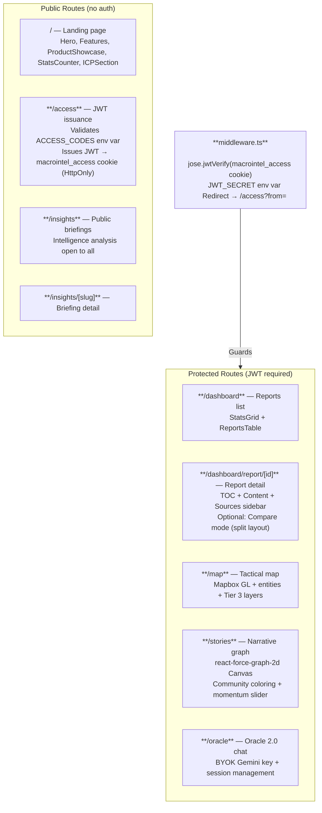
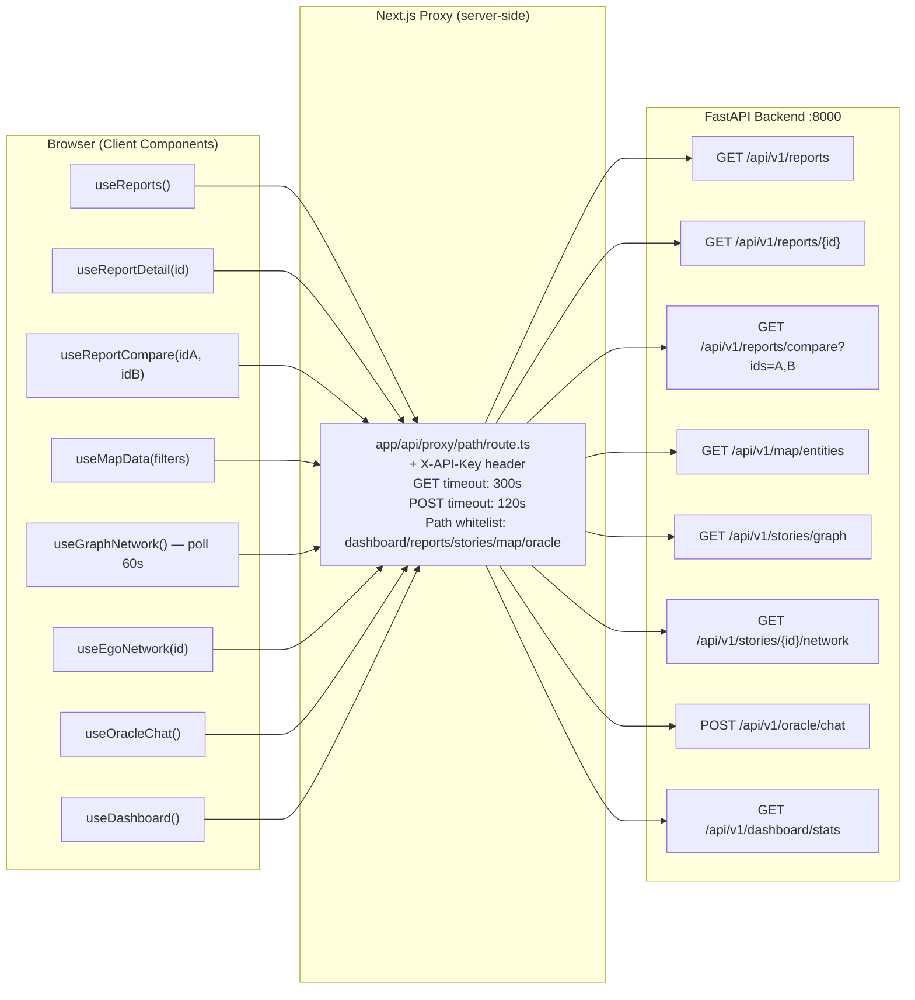
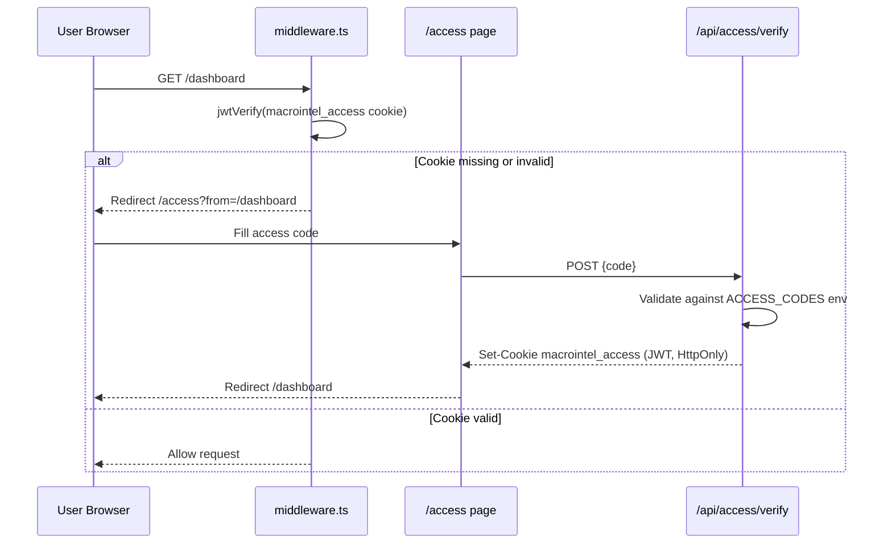

# Frontend Architecture — Next.js 16 App Router

`web-platform/` — Next.js 16 / React 19 / TypeScript 5 / Tailwind CSS 4

## Route Map & Authentication



---

## SWR Data Fetching Flow

All backend calls go through the Next.js server-side proxy (`app/api/proxy/[...path]/route.ts`) which adds the `X-API-Key` header — the key is never exposed to the browser.



---

## Component Tree

```mermaid
flowchart TD
    subgraph Dashboard
        DASH["/dashboard/report/[id]"]
        DASH --> TOC[TableOfContents]
        DASH --> CONTENT[ReportContent\nMarkdown renderer]
        DASH --> SRC_SB[SourcesSidebar\ncitations list]
        SRC_SB --> SRC_CARD["ReportSourceCard[N]\ncitation badges"]
        DASH --> COMP_DELTA["ComparisonDelta\n(when compareId set)\n4 collapsible sections"]
    end

    subgraph Map
        MAPPAGE["/map"]
        MAPPAGE --> MAP_LOAD["MapLoader\n(dynamic import ssr:false)"]
        MAP_LOAD --> TAC[TacticalMap\nMapbox GL]
        TAC --> FP[FilterPanel\nTYPE/SCORE/DAYS/SEARCH]
        TAC --> HUD[HUDOverlay\nZULU clock + coordinates]
        TAC --> GRID[GridOverlay\nCSS tactical grid]
        TAC --> ED[EntityDossier\n450px slide-in\nintelligence score + articles]
    end

    subgraph Stories
        STORPAGE["/stories"]
        STORPAGE --> GR_LOAD["GraphLoader\n(dynamic import ssr:false)"]
        GR_LOAD --> SG["StorylineGraph\nreact-force-graph-2d\nCanvas 2D custom paint"]
        SG --> LEGEND["Legend (top-right)\n15 community colors + Others(N)"]
        SG --> SLIDER["Momentum slider (top-right)\n0–1 step 0.1"]
        SG --> FILTER_ENT["Entity filter (top-right)\nautocomplete + chips"]
        SG --> FILTER_TTL["Title search (top-right)\nkeyword filter"]
        SG --> SD[StorylineDossier\n450px slide-in\nmomentum + summary + connected]
    end

    subgraph Oracle
        ORCPAGE["/oracle"]
        ORCPAGE --> OH[OracleHeader\nlogo + guide + settings]
        OH --> SETTINGS[OracleSettingsPanel\nBYOK key + filters + date range]
        OH --> GUIDE[OracleGuideModal\n6 intent type cards]
        ORCPAGE --> EMPTY[OracleEmptyState\nwelcome grid + quick chips]
        ORCPAGE --> MSG["OracleMessage[]\nuser + assistant bubbles\ninline citations [N]"]
        ORCPAGE --> THINK[OracleThinkingState\nASCII spinner + steps]
        ORCPAGE --> SRCSB[OracleSourcesSidebar\nExpandable source cards]
    end
```



---

## Visualization Libraries

| Component | Library | Rendering | SSR |
|-----------|---------|-----------|-----|
| Intelligence Map | Mapbox GL | WebGL | `ssr: false` (dynamic import) |
| Narrative Graph | react-force-graph-2d | Canvas 2D | `ssr: false` (dynamic import) |
| Charts/stats | Inline Tailwind | CSS | Server OK |
| Map animations | Framer Motion | CSS/JS | Server OK |

**Why `ssr: false`:** Both Mapbox GL and react-force-graph-2d require browser APIs (`window`, `canvas`). Dynamic import with `ssr: false` prevents Next.js SSR crashes.

---

## StorylineGraph — Rendering Details

`components/StorylineGraph/StorylineGraph.tsx`

```
Node radius:   4 + momentum_score × 12  → range [4, 16] px
Node opacity:  max(0.5, min(1.0, 0.5 + momentum_score × 0.5))  → [0.5, 1.0]
Node color:    Community-based (top 15 communities → unique COMMUNITY_PALETTE colors)
               All other communities → #2A3A4A (neutral dark gray "Others")
Ego network:   Selected node neighbors → white highlight
               Non-neighbors → alpha = 0.08 (dimmed)
```

**15-color COMMUNITY_PALETTE:**
`#FF6B35, #00A8E8, #7B68EE, #00CED1, #FFD700, #FF69B4, #32CD32, #FF4500, #FF7F7F, #ADFF2F, #87CEEB, #DA70D6, #00FA9A, #FA8072, #4682B4`

---

## Authentication Flow


