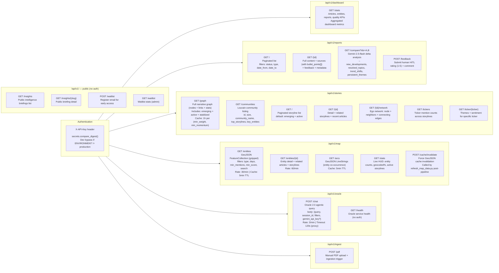
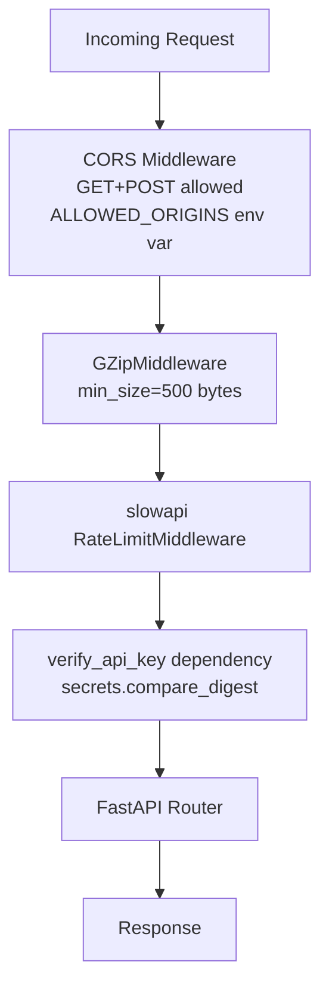

# API Endpoint Map

FastAPI backend — `src/api/main.py` + `src/api/routers/`

Base URL: `https://api.macrointel.net` (prod) / `http://localhost:8000` (dev)

## Endpoint Overview



---

## Rate Limits

| Endpoint | Limit | Key |
|----------|-------|-----|
| `POST /api/v1/oracle/chat` | **3 / min** | IP |
| `GET /api/v1/map/entities` | 30 / min | IP |
| `GET /api/v1/map/entities/{id}` | 60 / min | IP |
| `GET /` (root) | 10 / min | IP |
| `GET /health` | 10 / min | IP |
| All other endpoints | Unlimited | — |

---

## Response Shape Conventions

### Success
```json
{
  "success": true,
  "data": { ... },
  "generated_at": "2026-04-14T10:00:00Z"
}
```

### Error (FastAPI default)
```json
{
  "detail": "error message"
}
```

### Oracle Response
```json
{
  "answer": "...",
  "sources": [{"id": 1, "title": "...", "url": "...", "relevance": 0.87, "key_points": [...]}],
  "query_plan": {"intent": "ANALYTICAL", "complexity": "medium", "tools": [...]},
  "execution_steps": [{"tool": "RAGTool", "status": "success", "duration_ms": 340}],
  "session_id": "...",
  "follow_up": false
}
```

---

## Middleware Stack



---

## Key Pydantic Schemas (`src/api/schemas/`)

| Schema | Fields | Used By |
|--------|--------|---------|
| `OracleRequest` | query, session_id, filters (OracleActiveFilters), gemini_api_key | POST /oracle/chat |
| `OracleActiveFilters` | mode, search_type, date_from, date_to, gpe_filter | Oracle request |
| `OracleResponse` | answer, sources, query_plan, execution_steps, session_id | POST /oracle/chat |
| `GraphNetwork` | nodes (StorylineNode[]), links (StorylineEdge[]), stats | GET /stories/graph |
| `ReportDetail` | id, date, type, content, sources (ReportSource[]), metadata | GET /reports/{id} |
| `ReportSource` | id, title, url, relevance_score, bullet_points[] | Report detail |
| `ReportComparisonResponse` | new_developments[], resolved_topics[], trend_shifts[], persistent_themes[] | GET /reports/compare |
| `MapEntitiesResponse` | type=FeatureCollection, features (GeoJSON Feature[]) | GET /map/entities |
| `DashboardStats` | article_count, entity_count, report_count, storyline_count, quality_metrics | GET /dashboard/stats |
