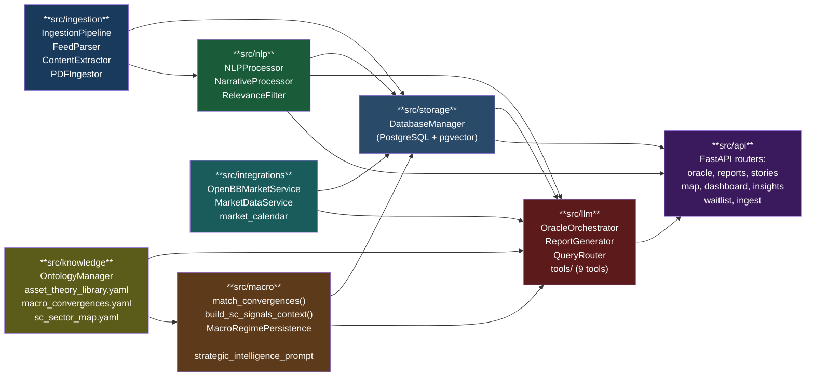
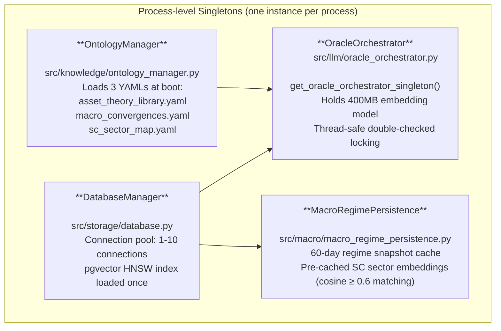

# Python Module Dependencies

`src/` package inter-module dependency graph.

## High-Level Module Graph

---

## Detailed Import Graph

```mermaid
flowchart TD
    subgraph ingestion["src/ingestion/"]
        IP[pipeline.py\nIngestionPipeline]
        FP[feed_parser.py\nFeedParser]
        CE[content_extractor.py\nContentExtractor]
        PDF[pdf_ingestor.py\nPDFIngestor]
        IP --> FP & CE & PDF
    end

    subgraph nlp["src/nlp/"]
        NP[processing.py\nNLPProcessor]
        NAR[narrative_processor.py\nNarrativeProcessor]
        RF[relevance_filter.py\nRelevanceFilter]
        BG[bullet_generator.py]
        NAR --> NP
    end

    subgraph llm["src/llm/"]
        OO[oracle_orchestrator.py\nOracleOrchestrator]
        OE[oracle_engine.py\nOracleEngine legacy]
        RG[report_generator.py\nReportGenerator]
        QR[query_router.py\nQueryRouter]
        CM[conversation_memory.py]
        SCH[schemas.py\nPydantic models]
        TOOLS[tools/\nRAG SQL Aggregation\nGraph Market Ticker\nReportCompare Reference Spatial]
        OO --> QR & CM & TOOLS & SCH
        RG --> SCH
    end

    subgraph macro["src/macro/"]
        MC[match_convergences.py]
        SC[build_sc_signals_context.py]
        MR[macro_regime_persistence.py\nMacroRegimePersistence]
        SP[strategic_intelligence_prompt.py]
        MAS[macro_analysis_schema.py]
        RG --> MC & SC & MR & SP & MAS
    end

    subgraph storage["src/storage/"]
        DB[database.py\nDatabaseManager singleton]
    end

    subgraph knowledge["src/knowledge/"]
        OM[ontology_manager.py\nOntologyManager singleton]
    end

    subgraph integrations["src/integrations/"]
        OBB[openbb_service.py\nOpenBBMarketService]
        MD[market_data.py legacy]
        CAL[market_calendar.py]
    end

    subgraph api["src/api/"]
        MAIN[main.py\nFastAPI app]
        AUTH[auth.py]
        OR[routers/oracle.py]
        RR[routers/reports.py]
        SR[routers/stories.py]
        MR2[routers/map.py]
        DR[routers/dashboard.py]
        MAIN --> OR & RR & SR & MR2 & DR & AUTH
    end

    IP --> DB
    NP --> DB
    NAR --> DB
    RF --> DB
    OBB --> DB
    MC --> DB
    MR --> DB
    OO --> DB
    OO --> TOOLS
    RG --> DB
    OM --> MC
    OM --> RG
    OBB --> RG
    OR --> OO
    RR --> DB
    SR --> DB
    MR2 --> DB
    DR --> DB
```

---

## Key Singletons

---

## Script → Module Usage Map

| Script | Primary Modules |
|--------|----------------|
| `daily_pipeline.py` | Orchestrates all scripts below |
| `process_nlp.py` | `src/nlp/processing.py`, `src/nlp/relevance_filter.py` |
| `load_to_database.py` | `src/storage/database.py` |
| `process_narratives.py` | `src/nlp/narrative_processor.py`, `src/storage/database.py` |
| `compute_communities.py` | `src/storage/database.py`, Gemini (community_name) |
| `fetch_daily_market_data.py` | `src/integrations/openbb_service.py`, `src/storage/database.py` |
| `generate_report.py` | `src/llm/report_generator.py` (imports everything) |
| `refresh_map_data.py` | `src/storage/database.py`, POST /api/v1/map/cache/invalidate |
| `geocode_geonames.py` | `src/storage/database.py`, Gemini, Photon HTTP |

---

## External Dependencies — Critical Constraints

| Package | Version | Constraint Reason |
|---------|---------|------------------|
| `openbb` | ==4.6.0 | Exact pin — API changes break `openbb_service.py` |
| `openbb-core` | >=1.6.0,<2.0.0 | Compatible with `python-multipart>=0.0.22,<0.0.23` |
| `python-multipart` | >=0.0.22,<0.0.23 | Security pin + openbb-core compat |
| `spacy` | 3.8.x | Model `xx_ent_wiki_sm` must match version |
| `sentence-transformers` | 5.1.x | Embedding dim = 384 (pgvector index built on this) |
| `google-generativeai` | 0.8.x | Gemini API surface |
| `fastapi` | 0.128.x | Pydantic v2 compat |
