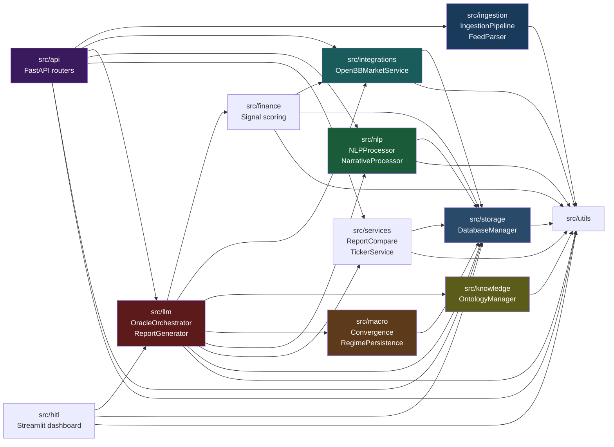
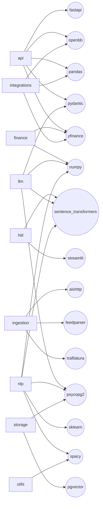
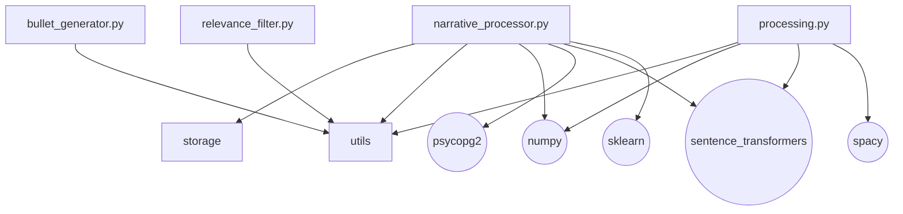
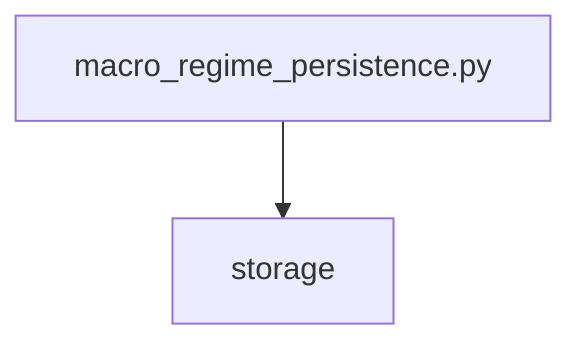

# INTELLIGENCE_ITA — Static Import Analysis

> Generated by `scripts/analyze_imports.py` using AST static analysis.

## Package-level dependency graph

## External library usage per package

## Dependency details

**src/api** → `src/ingestion`, `src/integrations`, `src/llm`, `src/nlp`, `src/services`, `src/storage`, `src/utils`
**src/finance** → `src/integrations`, `src/storage`, `src/utils`
**src/hitl** → `src/llm`, `src/storage`, `src/utils`
**src/ingestion** → `src/utils`
**src/integrations** → `src/storage`, `src/utils`
**src/knowledge** → `src/utils`
**src/llm** → `src/finance`, `src/integrations`, `src/knowledge`, `src/macro`, `src/nlp`, `src/services`, `src/storage`, `src/utils`
**src/macro** → `src/storage`
**src/nlp** → `src/storage`, `src/utils`
**src/services** → `src/storage`, `src/utils`
**src/storage** → `src/utils`

## src/llm — file-level graph

```mermaid
flowchart TD
    conversation_memory["conversation_memory.py"]
    oracle_engine["oracle_engine.py"]
    oracle_orchestrator["oracle_orchestrator.py"]
    query_analyzer["query_analyzer.py"]
    query_router["query_router.py"]
    report_generator["report_generator.py"]
    schemas["schemas.py"]
    aggregation_tool["aggregation_tool.py"]
    base["base.py"]
    graph_tool["graph_tool.py"]
    market_tool["market_tool.py"]
    rag_tool["rag_tool.py"]
    reference_tool["reference_tool.py"]
    report_compare_tool["report_compare_tool.py"]
    spatial_tool["spatial_tool.py"]
    sql_tool["sql_tool.py"]
    ticker_themes_tool["ticker_themes_tool.py"]
    EXT_numpy(("numpy"))
    EXT_psycopg2(("psycopg2"))
    EXT_pydantic(("pydantic"))
    EXT_sentence_transformers(("sentence_transformers"))

    conversation_memory --> utils
    oracle_engine --> storage
    oracle_engine --> utils
    oracle_orchestrator --> storage
    oracle_orchestrator --> utils
    query_analyzer --> utils
    query_router --> utils
    report_generator --> finance
    report_generator --> integrations
    report_generator --> knowledge
    report_generator --> macro
    report_generator --> nlp
    report_generator --> storage
    report_generator --> utils
    aggregation_tool --> utils
    graph_tool --> utils
    market_tool --> utils
    rag_tool --> utils
    reference_tool --> utils
    report_compare_tool --> services
    report_compare_tool --> utils
    spatial_tool --> utils
    sql_tool --> utils
    ticker_themes_tool --> services
    ticker_themes_tool --> utils
    oracle_engine --> EXT_sentence_transformers
    query_analyzer --> EXT_pydantic
    report_generator --> EXT_numpy
    report_generator --> EXT_psycopg2
    report_generator --> EXT_pydantic
    report_generator --> EXT_sentence_transformers
    schemas --> EXT_pydantic
    base --> EXT_pydantic
    rag_tool --> EXT_sentence_transformers
    spatial_tool --> EXT_pydantic
```

## src/nlp — file-level graph

## src/macro — file-level graph

## src/api — file-level graph

```mermaid
flowchart TD
    auth["auth.py"]
    main["main.py"]
    openbb_api_cors["openbb_api_cors.py"]
    openbb_backend["openbb_backend.py"]
    oracle_auth["oracle_auth.py"]
    dashboard["dashboard.py"]
    ingest["ingest.py"]
    insights["insights.py"]
    map["map.py"]
    oracle["oracle.py"]
    reports["reports.py"]
    stories["stories.py"]
    waitlist["waitlist.py"]
    common["common.py"]
    dashboard["dashboard.py"]
    map["map.py"]
    oracle["oracle.py"]
    reports["reports.py"]
    stories["stories.py"]
    EXT_fastapi(("fastapi"))
    EXT_openbb(("openbb"))
    EXT_pandas(("pandas"))
    EXT_pydantic(("pydantic"))
    EXT_yfinance(("yfinance"))

    main --> storage
    main --> utils
    openbb_backend --> integrations
    openbb_backend --> storage
    openbb_backend --> utils
    dashboard --> storage
    ingest --> ingestion
    ingest --> nlp
    ingest --> storage
    ingest --> utils
    insights --> storage
    insights --> utils
    map --> storage
    oracle --> llm
    reports --> services
    reports --> storage
    stories --> services
    stories --> storage
    waitlist --> storage
    waitlist --> utils
    auth --> EXT_fastapi
    main --> EXT_fastapi
    main --> EXT_pydantic
    openbb_api_cors --> EXT_fastapi
    openbb_api_cors --> EXT_openbb
    openbb_backend --> EXT_fastapi
    openbb_backend --> EXT_pandas
    openbb_backend --> EXT_yfinance
    oracle_auth --> EXT_fastapi
    dashboard --> EXT_fastapi
    ingest --> EXT_fastapi
    ingest --> EXT_pydantic
    insights --> EXT_fastapi
    map --> EXT_fastapi
    oracle --> EXT_fastapi
    reports --> EXT_fastapi
    stories --> EXT_fastapi
    waitlist --> EXT_fastapi
    waitlist --> EXT_pydantic
    common --> EXT_pydantic
    dashboard --> EXT_pydantic
    map --> EXT_pydantic
    oracle --> EXT_pydantic
    reports --> EXT_pydantic
    stories --> EXT_pydantic
```

